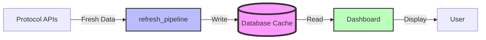
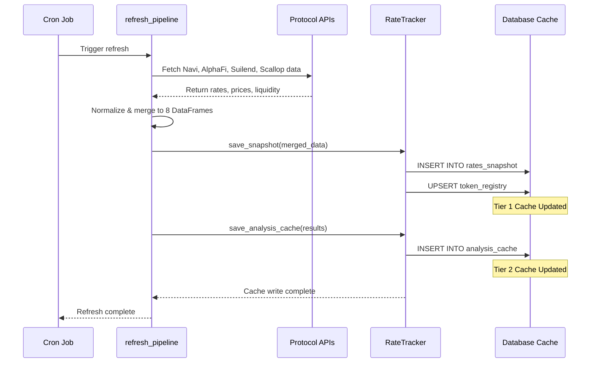
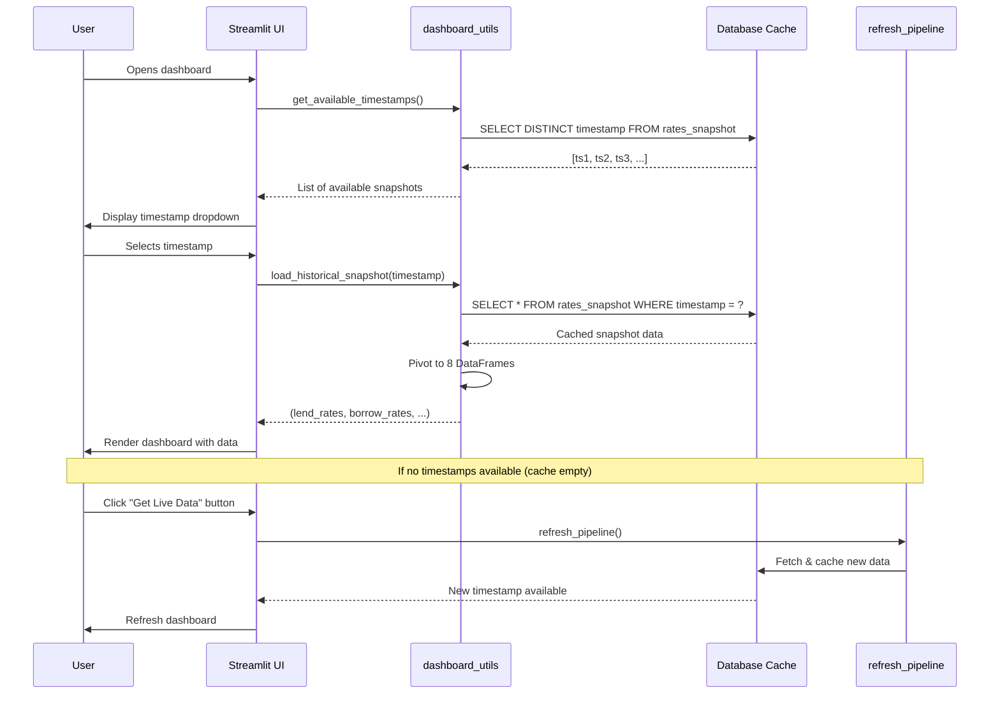
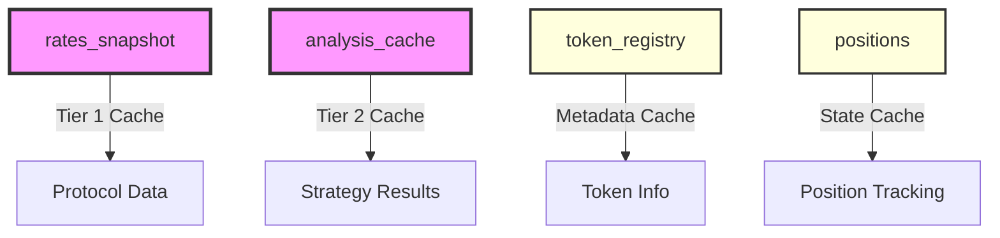

# Sui Lending Bot - Comprehensive Architecture Map

## Overview

This document provides a complete architectural map of the Sui Lending Bot project, covering:
1. **Data Flow**: refresh_pipeline → database insertion
2. **Dashboard Flow**: User journey from opening dashboard → viewing metrics → deploying positions → tracking performance
3. **Database Schema**: All tables, columns, relationships, and purposes
4. **API/SDK Response Structures**: (Future - Point 4 to be added later)

## Production Deployment

**Status**: Deployed on Railway with Supabase PostgreSQL database
- **Database**: Supabase PostgreSQL (cloud-hosted)
- **Platform**: Railway
- **Accessibility**: Remotely accessible via Railway deployment
- **Refresh Schedule**: Every hour, at the top of the hour
- **Historical Note**: Originally developed with local SQLite database for development

---

## Caching Architecture Overview

### The Database IS the Cache

**Core Architectural Principle**: The database serves as the primary cache layer between protocol APIs and the dashboard. The dashboard NEVER calls protocol APIs directly—all data flows through the database cache.

### Two-Tier Caching Strategy



#### Tier 1: Protocol Data Cache (rates_snapshot)
- **Purpose**: Time-series cache of all lending/borrowing rates, prices, and liquidity data from all protocols
- **Key**: (timestamp, protocol, token_contract)
- **Update Pattern**: Append-only (no updates to historical data)
- **Access Pattern**: Timestamp-based lookups for historical analysis and "time travel"

#### Tier 2: Analysis Results Cache (analysis_cache)
- **Purpose**: Pre-computed strategy analysis results stored as JSON
- **Key**: (timestamp_seconds, liquidation_distance)
- **Update Pattern**: Computed during refresh_pipeline, cached for fast re-rendering
- **Access Pattern**: Direct lookup when user adjusts parameters

#### Future: Chart Cache (Planned, Not Yet Implemented)
- **Purpose**: Rendered chart HTML/JSON for instant display
- **Status**: Planned but not yet implemented

### Architecture Benefits

| Aspect | Value |
|--------|-------|
| **Performance** | Dashboard loads instantly from database queries |
| **Historical Analysis** | Full time-series enables backtesting and trend analysis |
| **Offline Support** | Dashboard accessible 24/7 via Railway (cloud-hosted) |
| **Time Travel** | Select any historical timestamp to see past market state |
| **Reliability** | Dashboard unaffected by protocol API outages |
| **Cost** | Minimize API calls to external protocols |

### Data Flow Separation

**Write Path (Protocols → Cache)**:
- Triggered by: Scheduled jobs on Railway deployment
- Frequency: Every hour, at the top of the hour
- Tools: [refresh_pipeline.py](../data/refresh_pipeline.py), [RateTracker](../data/rate_tracker.py)

**Read Path (Cache → Dashboard)**:
- Triggered by: User opens dashboard or selects timestamp
- Frequency: On-demand, instant
- Tools: [dashboard_utils.py](../dashboard/dashboard_utils.py), [UnifiedDataLoader](../dashboard/data_loaders.py)

---

## Time-Travel Flow: Timestamp Selection → Data Loading → Rendering

This flow shows how users can "time travel" to any historical snapshot by selecting a timestamp. The selected timestamp becomes "now" for all calculations (Design Principle #1).

```
┌─────────────────────────────────────────────────────────────┐
│ PHASE 1: AVAILABLE TIMESTAMPS (Cache Index)                 │
└─────────────────────────────────────────────────────────────┘
   Dashboard loads
   ├─ get_available_timestamps()
   │  └─ SELECT DISTINCT timestamp FROM rates_snapshot
   └─ Returns: [ts1, ts2, ts3, ...] (sorted desc)

                    ↓

┌─────────────────────────────────────────────────────────────┐
│ PHASE 2: USER SELECTION (Timestamp Picker)                  │
└─────────────────────────────────────────────────────────────┘
   User interacts with dropdown
   │
   ├─ Default: Latest timestamp (most recent)
   ├─ Options: All historical snapshots
   └─ Selects: 2026-02-14 15:00:00
      └─ Converts to Unix seconds: 1739548800

                    ↓

┌─────────────────────────────────────────────────────────────┐
│ PHASE 3: DATA LOADING (Cache Lookup)                        │
└─────────────────────────────────────────────────────────────┘
   load_historical_snapshot(timestamp_seconds)
   │
   ├─ SELECT * FROM rates_snapshot
   │  WHERE timestamp = 1739548800
   │
   ├─ Pivot into 8 DataFrames
   │  ├─ lend_rates (Token × Protocol matrix)
   │  ├─ borrow_rates
   │  ├─ collateral_ratios
   │  ├─ prices
   │  ├─ lend_rewards
   │  ├─ borrow_rewards
   │  ├─ available_borrow
   │  └─ borrow_fees
   │
   └─ Returns: (df1, df2, ..., df8, timestamp)

                    ↓

┌─────────────────────────────────────────────────────────────┐
│ PHASE 4: RENDERING (Dashboard Display)                      │
└─────────────────────────────────────────────────────────────┘
   Dashboard renders with selected timestamp as "now"
   │
   ├─ All strategies use rates from selected timestamp
   ├─ All positions calculate PnL up to selected timestamp
   ├─ All APRs based on selected timestamp's rates
   └─ User can "time travel" to any cached snapshot
```

**Key Architectural Points:**

| Aspect | Implementation |
|--------|----------------|
| **Timestamp as "Now"** | Selected timestamp IS current time (Design Principle #1) |
| **Query Pattern** | All queries use `WHERE timestamp <= selected_timestamp` |
| **No API Calls** | Dashboard never calls protocol APIs directly |
| **Performance** | Time travel is instant (cache lookup only) |
| **Data Consistency** | All data from same snapshot (no mixing timestamps) |

**Benefits:**
- **Historical Analysis**: Replay any past market state
- **Backtesting**: Test strategies with historical data
- **Debugging**: Investigate issues at exact timestamp
- **Instant**: No API calls, pure database lookup

---

## Complete Data Flow: Strategy Discovery to Position Deployment

This end-to-end flow shows how the system works from data collection through position deployment:

```
┌─────────────────────────────────────────────────────────────┐
│ PHASE 1: DATA COLLECTION (Hourly on Railway)                │
└─────────────────────────────────────────────────────────────┘
   refresh_pipeline()
   ├─ Fetches rates, prices, fees from all protocols
   ├─ Saves to rates_snapshot table (immutable)
   └─ Returns: merged DataFrames

                    ↓

┌─────────────────────────────────────────────────────────────┐
│ PHASE 2: STRATEGY DISCOVERY (Analysis Layer)                │
└─────────────────────────────────────────────────────────────┘
   RateAnalyzer.analyze_all_combinations()
   │
   ├─ For each strategy type:
   │  │
   │  ├─ _generate_stablecoin_strategies()
   │  │  └─ Iterate: stablecoin × protocol
   │  │     └─ Call calculator.analyze_strategy()
   │  │        └─ Returns: {l_a, b_a, l_b, b_b, net_apr, ...}
   │  │
   │  ├─ _generate_noloop_strategies()
   │  │  └─ Iterate: stablecoin × high-yield × protocol_pair
   │  │     └─ Call calculator.analyze_strategy()
   │  │        └─ Returns: {l_a, b_a, l_b, b_b, net_apr, ...}
   │  │
   │  └─ _generate_recursive_strategies()
   │     └─ Iterate: token1 × token2 × token3 × protocol_pair
   │        └─ Call calculator.analyze_strategy()
   │           └─ Returns: {l_a, b_a, l_b, b_b, net_apr, ...}
   │
   └─ Combine all results into single DataFrame
      └─ Sort by net_apr descending
         └─ Returns: DataFrame with 100-500+ strategies

                    ↓

┌─────────────────────────────────────────────────────────────┐
│ PHASE 3: DISPLAY IN DASHBOARD (View Layer)                  │
└─────────────────────────────────────────────────────────────┘
   "All Strategies" Tab
   │
   ├─ Shows DataFrame from analyzer.analyze_all_combinations()
   ├─ User can filter by strategy_type
   ├─ User can sort by APR, max_size, etc.
   └─ Each row has "Deploy" button

                    ↓

┌─────────────────────────────────────────────────────────────┐
│ PHASE 4: USER DEPLOYS POSITION (Writes to database)         │
└─────────────────────────────────────────────────────────────┘
   User clicks "Deploy" button on a strategy
   │
   └─ position_service.create_position()
      ├─ Takes strategy data from DataFrame row
      ├─ Creates position_id (UUID)
      ├─ INSERT INTO positions table
      └─ Position now exists in database
```

**Key Architectural Points:**

| Phase | Layer | Database Writes | Purpose |
|-------|-------|-----------------|---------|
| **Phase 1** | Data Collection | rates_snapshot (immutable) | Cache market data |
| **Phase 2** | Analysis | analysis_cache (optional) | Discover opportunities |
| **Phase 3** | View | None | Display & explore |
| **Phase 4** | Action | positions table | Deploy capital |

**Critical Distinctions:**
- **Discovery ≠ Deployment**: Strategy generation (Phases 2-3) is pure analysis with no position writes
- **Immutable vs Mutable**: rates_snapshot is append-only; positions table is mutable (status changes)
- **Cached Analysis**: Phase 2 results can be cached in analysis_cache for fast re-rendering
- **Explicit User Action**: Only Phase 4 creates positions; Phases 2-3 are read-only exploration

---

## Rebalancing Flow: Detection → Manual Rebalance → Segment Creation

This flow shows how positions are rebalanced when prices drift or liquidation risk increases. Rebalancing is **manual** (user-initiated) based on **automatic** detection signals.

```
┌─────────────────────────────────────────────────────────────┐
│ PHASE 1: REBALANCE DETECTION (Automatic)                    │
└─────────────────────────────────────────────────────────────┘
   Position Expander Renders
   ├─ Calculates liquidation distance
   │  └─ distance = (liq_price - live_price) / live_price
   │
   ├─ Calculates price drift per token
   │  └─ drift = (live_price - entry_price) / entry_price
   │
   ├─ Checks against threshold (15% default)
   │  └─ If abs(drift) > threshold → needs rebalance
   │
   └─ Displays "Rebal Req'd?" column with drift %
      └─ Example: "Yes (+6.7%)" (DEEP price increased 6.7%)

                    ↓

┌─────────────────────────────────────────────────────────────┐
│ PHASE 2: USER DECISION (Manual)                             │
└─────────────────────────────────────────────────────────────┘
   User reviews position
   │
   ├─ Sees rebalance indicator: "Yes (+6.7%)"
   ├─ Sees liquidation distance: "17.1%" (getting closer to liq)
   ├─ Reviews current APR vs entry APR
   │
   └─ Clicks "⚖️ Rebalance" button
      └─ Triggers rebalance confirmation modal

                    ↓

┌─────────────────────────────────────────────────────────────┐
│ PHASE 3: REBALANCE EXECUTION (Database Write)               │
└─────────────────────────────────────────────────────────────┘
   position_service.rebalance_position()
   │
   ├─ INSERT INTO position_rebalances
   │  ├─ position_id = <position_uuid>
   │  ├─ sequence_number = next in sequence (1, 2, 3, ...)
   │  ├─ segment_start_timestamp = previous_entry_timestamp
   │  ├─ segment_end_timestamp = live_timestamp (now)
   │  │
   │  ├─ closing_* = rates/prices at rebalance time
   │  │  ├─ closing_lend_rate_1A
   │  │  ├─ closing_price_1A
   │  │  └─ ... (all legs)
   │  │
   │  ├─ opening_* = NEW rates/prices after rebalance
   │  │  ├─ opening_lend_rate_1A
   │  │  ├─ opening_price_1A
   │  │  └─ ... (all legs)
   │  │
   │  └─ realized_pnl = PnL for closed segment
   │     └─ Calculated from segment_start → segment_end
   │
   └─ UPDATE positions SET
      ├─ entry_timestamp = live_timestamp (RESET)
      ├─ entry_lend_rate_1A = NEW rate (RESET)
      ├─ entry_price_1A = NEW price (RESET)
      ├─ ... (all entry_* fields RESET)
      └─ updated_at = now

                    ↓

┌─────────────────────────────────────────────────────────────┐
│ PHASE 4: SEGMENT CREATION (Historical Tracking)             │
└─────────────────────────────────────────────────────────────┘
   Position now has segments
   │
   ├─ Segment 1: 2026-01-15 → 2026-01-20 (5.0 days)
   │  ├─ Status: CLOSED (finalized)
   │  ├─ Realized PnL: $42.31
   │  └─ Stored in position_rebalances (sequence_number=1)
   │
   ├─ Segment 2: 2026-01-20 → 2026-01-25 (5.0 days)
   │  ├─ Status: CLOSED (finalized)
   │  ├─ Realized PnL: $38.12
   │  └─ Stored in position_rebalances (sequence_number=2)
   │
   └─ Live Segment: 2026-01-25 → Now (3.2 days)
      ├─ Status: ACTIVE (ongoing)
      ├─ Unrealized PnL: $12.45
      └─ Uses current entry_* from positions table
```

**Key Architectural Points:**

| Aspect | Implementation |
|--------|----------------|
| **Detection** | Automatic (calculated on every render) |
| **Execution** | Manual (user must confirm) |
| **Entry State Reset** | All entry_* fields updated to "new normal" |
| **Historical Segments** | Each rebalance creates closed segment with realized PnL |
| **PnL Tracking** | Sum of (closed segments + live segment) = total PnL |

**Why Manual Rebalancing?**
1. **User Control**: User decides when to incur transaction costs
2. **Gas Costs**: Rebalancing costs gas (not automated to save costs)
3. **Market Timing**: User may want to wait for better rates
4. **Risk Tolerance**: User decides liquidation distance threshold

**What Rebalancing Does:**
- **Closes Current Segment**: Finalizes PnL for time period
- **Creates Historical Record**: Stores segment in position_rebalances
- **Resets Entry State**: Position starts fresh with new rates/prices
- **Preserves History**: Old segments retained for analysis

---

## 1. REFRESH PIPELINE DATA FLOW

### 1.0 Caching Strategy Overview

The refresh pipeline is the **write path** for the caching system. Its sole purpose is to:
1. Fetch fresh data from protocol APIs
2. Normalize and merge data into unified format
3. **Write to database cache** (rates_snapshot, token_registry, analysis_cache)
4. Validate data quality

**Critical**: The refresh pipeline does NOT serve the dashboard directly. It populates the cache, and the dashboard reads from the cache.



---

### Entry Point: `main.py`

```
main()
  └─ refresh_pipeline(timestamp=datetime.now(), save_snapshots=True)
```

### Phase 1: Data Fetching from Protocols

**File**: [data/protocol_merger.py](../data/protocol_merger.py)

**Function**: `merge_protocol_data(stablecoin_contracts)`

**Protocols & Data Sources**:

| Protocol | Reader Class | Data Source | Method |
|----------|--------------|-------------|--------|
| **Navi** | `NaviReader` | REST API | `GET https://open-api.naviprotocol.io/api/navi/pools?env=prod&sdk=1.3.4-dev.2` |
| **AlphaFi** | `AlphaFiReader` | Node.js SDK (subprocess) | `node data/alphalend/alphalend_reader-sdk.mjs` → RPC |
| **Suilend** | `SuilendReader` | Node.js SDK (subprocess) | `node data/suilend/suilend_reader-sdk.mjs` → RPC |
| **ScallopLend** | `ScallopLendReader` | Node.js SDK (subprocess) | `node data/scallop_shared/scallop_reader-sdk.mjs` → RPC |
| **ScallopBorrow** | `ScallopBorrowReader` | Node.js SDK (subprocess) | `node data/scallop_shared/scallop_reader-sdk.mjs` → RPC |

**Key Configuration**:
- All SDK readers use `SUI_RPC_URL` from [config/settings.py](../config/settings.py)
- Timeout: 60 seconds per protocol
- Error handling: Graceful degradation (failed protocols return empty DataFrames)

**Each Protocol Returns**:
- `lend_df`: Supply rates, rewards, liquidity
- `borrow_df`: Borrow rates, rewards, fees
- `collateral_df`: Collateral factors, LTVs

### Phase 2: Data Transformation & Merging

**File**: [data/protocol_merger.py](../data/protocol_merger.py) (Lines 132-334)

**Process**:

1. **Normalize Contract Addresses**
   ```python
   normalize_coin_type("0x00002::sui::SUI") → "0x2::sui::SUI"
   ```
   - Removes leading zeros for consistent matching

2. **Build Token Universe**
   - Collect all unique token contracts across all protocols
   - Map: `contract_address → {symbol, set_of_protocols}`

3. **Apply Filtering Rules**

   Keep tokens that meet EITHER criterion:
   - **Is a stablecoin** (from [config/stablecoins.py](../config/stablecoins.py)), OR
   - **Has lending rates in 2+ unique protocols** (Note: ScallopLend + ScallopBorrow count as 1 protocol)

   Typical result: ~10 tokens retained from ~40 candidates (75% filtered out)

4. **Build 8 Unified DataFrames**

   For each token, create row with protocol columns:

   | DataFrame | Columns | Data Source | Purpose |
   |-----------|---------|-------------|---------|
   | **lend_rates** | Token, Contract, Navi, AlphaFi, Suilend, ScallopLend, ScallopBorrow | `supply_info.get('Supply_apr')` | Supply APR across protocols |
   | **borrow_rates** | Token, Contract, Navi, AlphaFi, ... | `borrow_info.get('Borrow_apr')` | Borrow APR across protocols |
   | **collateral_ratios** | Token, Contract, Navi, AlphaFi, ... | `collateral.get('Collateralization_factor')` | LTV/collateral factor |
   | **prices** | Token, Contract, Navi, AlphaFi, ... | `lend_info.get('Price')` | USD price per token |
   | **lend_rewards** | Token, Contract, Navi, AlphaFi, ... | `supply_info.get('Supply_reward_apr')` | Supply reward APR |
   | **borrow_rewards** | Token, Contract, Navi, AlphaFi, ... | `borrow_info.get('Borrow_reward_apr')` | Borrow reward APR |
   | **available_borrow** | Token, Contract, Navi, AlphaFi, ... | `lend_info.get('Available_borrow_usd')` | Available borrow liquidity (USD) |
   | **borrow_fees** | Token, Contract, Navi, AlphaFi, ... | `lend_info.get('Borrow_fee')` | Upfront borrow fee (decimal) |

   **Important**: Each cell is `NaN` if protocol doesn't support that token

### Phase 3: Database Persistence

**File**: [data/rate_tracker.py](../data/rate_tracker.py)

**Condition**: Only if `save_snapshots=True` (default)

**Step 3A: Initialize RateTracker**

```python
tracker = RateTracker(
    use_cloud=settings.USE_CLOUD_DB,       # Always True in production (Supabase)
    db_path="data/lending_rates.db",        # Legacy: SQLite file (local dev only)
    connection_url=settings.SUPABASE_URL    # Production: Supabase PostgreSQL URL
)
```

**Production Note**: The system is deployed on Railway with `USE_CLOUD_DB=True`, using Supabase PostgreSQL exclusively. SQLite was only used during initial local development.

**Step 3B: Save Rate Snapshot**

**Function**: `tracker.save_snapshot()` → `_save_rates_snapshot()`

**Process**:
1. Extract protocol list from DataFrame column headers
2. For EACH token × protocol combination:
   - Get total APRs (lend, borrow)
   - Calculate base APRs:
     - **Lend base** = lend_total - lend_reward
     - **Borrow base** = borrow_total + borrow_reward
   - Get collateral ratio, price, available_borrow, borrow_fee
3. Create 1 row per token/protocol combination
4. Insert into **`rates_snapshot`** table

**Typical Snapshot**: ~47 rows (10 tokens × 4-5 protocols)

**Step 3C: Save Token Registry**

**Function**: `tracker.upsert_token_registry()`

**Process**:
1. Extract unique tokens: `{symbol, contract}`
2. Upsert into **`token_registry`** table
3. Update discovery metadata:
   - `seen_on_navi`, `seen_on_alphafi`, etc. (sticky flags - once 1, stays 1)
   - `first_seen`, `last_seen` timestamps
   - `pyth_id`, `coingecko_id` (NEVER overwritten - manual enrichment)

**Step 3D: Data Quality Validation**

**Thresholds**:
- Minimum rows: 20 (normal: ~47)
- Minimum protocols: 2 (expect: 3+)

**Alert**: If thresholds fail → Slack notification to ops team

### Phase 4: Strategy Analysis

**File**: [analysis/rate_analyzer.py](../analysis/rate_analyzer.py)

**Function**: `RateAnalyzer(merged_data).find_best_protocol_pair()`

**Step 4A: Analyze All Combinations**

Iterate through:
- All token combinations: {token1, token2, token3}
- All protocol pairs: {protocol_A, protocol_B}
- **Constraint**: token1 MUST be stablecoin (market-neutral requirement)

**Step 4B: Calculate Position Sizes**

**File**: [analysis/position_calculator.py](../analysis/position_calculator.py)

**Function**: `PositionCalculator.analyze_strategy()`

**Geometric Series Calculation**:
```
L_A = 1.0 / (1.0 - r_A × r_B)    # Total lent in Protocol A
B_A = L_A × r_A                   # Total borrowed from Protocol A
L_B = B_A                         # Total lent in Protocol B (= borrowed from A)
B_B = L_B × r_B                   # Total borrowed from Protocol B
```

Where:
- `r_A` = collateral ratio at Protocol A
- `r_B` = collateral ratio at Protocol B

**Step 4C: Calculate Net APR**

```
Net APR = (earnings) - (costs) - (fees)

Earnings:
  + L_A × lend_rate_token1_A       [Lend stablecoin in Protocol A]
  + L_B × lend_rate_token2_B       [Lend high-yield token in Protocol B]

Costs:
  - B_A × borrow_rate_token2_A     [Borrow high-yield from Protocol A]
  - B_B × borrow_rate_token1_B     [Borrow stablecoin from Protocol B]

Fees:
  - B_A × borrow_fee_2A            [Transaction fee on Token2 borrow]
  - B_B × borrow_fee_3B            [Transaction fee on Token3 borrow]
```

**Step 4D: Build Results DataFrame**

**Columns**:
- Token identifiers: `token1`, `token2`, `token3` (symbols)
- Contracts: `token1_contract`, `token2_contract`, `token3_contract`
- Protocols: `protocol_A`, `protocol_B`
- Position sizes: `L_A`, `B_A`, `L_B`, `B_B`
- Component rates: `lend_apr_token1_A`, `borrow_apr_token2_A`, etc.
- Performance: `net_apr`, `apr5`, `apr30`, `apr90`
- Constraints: `liquidation_distance`, `max_size`, `valid`
- Metadata: `timestamp` (Unix seconds), `is_stablecoin_only`

**Output**: DataFrame with 200+ strategies, sorted by `net_apr` descending

---

## Strategy Calculator Registry: Type → Calculator Class Mapping

The system uses a **registry pattern** to map strategy types to calculator classes. This enables a plugin architecture where new strategy types can be added without modifying existing code.

### Registered Strategy Types (Current)

| Strategy type | Calculator class | Generator method | Legs |
|--------------|-----------------|-----------------|------|
| `stablecoin_lending` | `StablecoinLendingCalculator` | `_generate_stablecoin_strategies()` | 1 |
| `noloop_cross_protocol_lending` | `NoLoopCrossProtocolCalculator` | `_generate_noloop_strategies()` | 3 |
| `recursive_lending` | `RecursiveLendingCalculator` | `_generate_recursive_strategies()` | 4 |
| `perp_lending` | `PerpLendingCalculator` | `_generate_perp_lending_strategies()` | 2 |
| `perp_borrowing` | `PerpBorrowingCalculator` | `_generate_perp_borrowing_strategies()` | 3 |
| `perp_borrowing_recursive` | `PerpBorrowingRecursiveCalculator` | `_generate_perp_borrowing_strategies()` | 3 (looped) |

All classes live in `analysis/strategy_calculators/` and are registered at module-load time in `analysis/strategy_calculators/__init__.py`.

`perp_borrowing` and `perp_borrowing_recursive` share the same generator method — the calculator class passed as an argument determines which position formula is used.

### Registry Pattern

```
┌─────────────────────────────────────────────────────────────┐
│ REGISTRY INITIALIZATION (Module Load Time)                   │
└─────────────────────────────────────────────────────────────┘
   analysis/strategy_calculators/__init__.py
   │
   └─ _CALCULATORS = {}
      register_calculator(StablecoinLendingCalculator)
      register_calculator(NoLoopCrossProtocolCalculator)
      register_calculator(RecursiveLendingCalculator)
      register_calculator(PerpLendingCalculator)
      register_calculator(PerpBorrowingCalculator)
      register_calculator(PerpBorrowingRecursiveCalculator)

                    ↓

┌─────────────────────────────────────────────────────────────┐
│ USAGE: RateAnalyzer.analyze_all_combinations()              │
└─────────────────────────────────────────────────────────────┘
   for strategy_type, calculator in self.calculators.items():
   │
   ├─ 'stablecoin_lending'           → _generate_stablecoin_strategies(calculator)
   ├─ 'noloop_cross_protocol_lending' → _generate_noloop_strategies(calculator)
   ├─ 'recursive_lending'            → _generate_recursive_strategies(calculator, tokens)
   ├─ 'perp_lending'                 → _generate_perp_lending_strategies(calculator)
   └─ 'perp_borrowing' /
      'perp_borrowing_recursive'     → _generate_perp_borrowing_strategies(calculator)
   │
   └─ Combined into single DataFrame, sorted by apr_net descending

                    ↓

┌─────────────────────────────────────────────────────────────┐
│ CALCULATOR INTERFACE (Base Class)                            │
└─────────────────────────────────────────────────────────────┘
   class StrategyCalculatorBase(ABC):
      @abstractmethod
      def get_strategy_type(self) -> str
      def get_required_legs(self) -> int
      def calculate_positions(self, ...) -> Dict[str, float]
      def calculate_gross_apr(self, positions, rates) -> float
      def calculate_net_apr(self, positions, rates, fees) -> float
      def analyze_strategy(self, ...) -> Dict[str, Any]
      def calculate_rebalance_amounts(self, ...) -> Dict

                    ↓

┌─────────────────────────────────────────────────────────────┐
│ CONCRETE CALCULATORS                                         │
└─────────────────────────────────────────────────────────────┘
   RecursiveLendingCalculator:
      calculate_positions()  L_A = 1 / (1 - r_A × r_B)  [4-leg geometric series]

   NoLoopCrossProtocolCalculator:
      calculate_positions()  L_A = 1.0, B_A = r_A, L_B = r_A  [3-leg, no loop]

   StablecoinLendingCalculator:
      calculate_positions()  L_A = 1.0, B_A = 0  [1-leg pure lending]

   PerpLendingCalculator:
      calculate_positions()  L_A = 1/(1+d), B_B = L_A  [2-leg: spot lend + perp short]

   PerpBorrowingCalculator:
      calculate_positions()  L_A = 1.0, B_A = r, L_B = r  [3-leg: stablecoin lend + borrow + long perp]

   PerpBorrowingRecursiveCalculator (inherits PerpBorrowingCalculator):
      calculate_positions()  L_A = 1/(1-r(1-d)), B_A = r×factor, L_B = r×factor  [looped]
      analyze_strategy()     super() + adds loop_ratio, loop_amplifier to result
```

### Adding a New Strategy Type

1. Create calculator class in `analysis/strategy_calculators/` inheriting `StrategyCalculatorBase`
2. Call `register_calculator(MyNewCalculator)` in `analysis/strategy_calculators/__init__.py`
3. Add `_generate_my_new_strategies(calculator)` to `RateAnalyzer`
4. Add `elif strategy_type == 'my_new_strategy':` dispatch in `analyze_all_combinations()`
5. Add history handler in `analysis/strategy_history/` and register it

**File References:**
- **Base Class + Registry**: [analysis/strategy_calculators/__init__.py](../analysis/strategy_calculators/__init__.py)
- **Strategy generator dispatch**: [analysis/rate_analyzer.py](../analysis/rate_analyzer.py) — `analyze_all_combinations()`
- **Perp strategy detail**: [docs/BorrowLend_Perp_Strategy.md](BorrowLend_Perp_Strategy.md)

---

### Phase 5: Portfolio Allocation (February 2026)

**File**: [analysis/portfolio_allocator.py](../analysis/portfolio_allocator.py)

**Purpose**: Allocate capital across strategies using greedy algorithm with constraints and iterative liquidity updates.

#### Feature: Iterative Liquidity Updates

**Status**: ✅ Implemented and Active (February 10, 2026)
**Feature Flag**: `DEBUG_ENABLE_ITERATIVE_LIQUIDITY_UPDATES` in config/settings.py (default: True)

**NOTE**: This is a DEBUG flag only for testing/comparison. Once validated, this flag will be removed and iterative updates will be always-on.

#### Problem Solved

Previous implementation calculated `max_size` once per strategy based on initial `available_borrow`. This allowed portfolios to over-borrow beyond actual protocol liquidity:

```
Example:
- Initial WAL available on Pebble: $100,000
- Strategy 1 borrows $100k WAL → OK
- Strategy 2 borrows $100k WAL → Over-borrowed by $100k! ❌
```

#### Solution Architecture

**Token×Protocol Matrix**: Track available borrow liquidity and update after each allocation.

```
Matrix Structure:
         Navi      Suilend   Pebble    AlphaFi
USDC     500000    800000    1000000   300000
WAL      150000    200000    100000    50000
DEEP     75000     100000    50000     25000
```

#### Portfolio Allocation Flow: Iterative Liquidity Updates

This detailed flow shows how the portfolio allocator prevents over-borrowing by iteratively updating available liquidity after each allocation.

```
┌─────────────────────────────────────────────────────────────┐
│ INPUT: Strategies DataFrame + Portfolio Constraints          │
└─────────────────────────────────────────────────────────────┘
   Example: 100 strategies, $100k portfolio size
                    ↓

┌─────────────────────────────────────────────────────────────┐
│ STEP 1: PREPARE STRATEGIES (Filtering & Ranking)            │
└─────────────────────────────────────────────────────────────┘
   Filter strategies
   ├─ confidence_threshold (e.g., 5+ data points)
   └─ Remove invalid strategies

   Calculate blended APR
   ├─ Weights: 40% net_apr, 30% apr5, 20% apr30, 10% apr90
   └─ Apply stablecoin preference penalties

   Sort by adjusted APR (descending)
   └─ Best strategies first

                    ↓

┌─────────────────────────────────────────────────────────────┐
│ STEP 2: INITIALIZE LIQUIDITY MATRIX (Token × Protocol)      │
└─────────────────────────────────────────────────────────────┘
   Build available_borrow matrix:

            Navi      Suilend   Pebble    AlphaFi
   USDC     500000    800000    1000000   300000
   WAL      150000    200000    100000    50000
   DEEP     75000     100000    50000     25000

   Source: available_borrow_2a, available_borrow_3b from strategies

                    ↓

┌─────────────────────────────────────────────────────────────┐
│ STEP 3: GREEDY ALLOCATION LOOP (With Iterative Updates)     │
└─────────────────────────────────────────────────────────────┘
   For each strategy in ranked order:
   │
   ├─ GET CURRENT MAX SIZE (may have changed)
   │  ├─ max_size = min(
   │  │     available_borrow[token2][protocol_a] / b_a,
   │  │     available_borrow[token3][protocol_b] / b_b
   │  │   )
   │  └─ If max_size <= 0: Skip strategy (no liquidity)
   │
   ├─ CALCULATE MAX ALLOCATION
   │  ├─ Remaining capital: capital_left
   │  ├─ Token exposure limits: max_token2, max_token3
   │  ├─ Protocol exposure limits: max_protocol_a, max_protocol_b
   │  └─ allocation = min(capital_left, max_token2, max_token3,
   │                       max_protocol_a, max_protocol_b, max_size)
   │
   ├─ ALLOCATE TO STRATEGY
   │  ├─ portfolio.append(strategy, allocation)
   │  ├─ capital_left -= allocation
   │  ├─ Update token exposures
   │  └─ Update protocol exposures
   │
   ├─ UPDATE LIQUIDITY MATRIX ◄── KEY INNOVATION
   │  ├─ borrow_2A_usd = allocation × strategy['borrow_weight_2A']
   │  ├─ borrow_3B_usd = allocation × strategy['borrow_weight_3B']
   │  │
   │  ├─ available_borrow[token2][protocol_a] -= borrow_2A_usd
   │  ├─ available_borrow[token3][protocol_b] -= borrow_3B_usd
   │  └─ Clamp negatives to 0
   │
   └─ RECALCULATE MAX SIZES (for remaining strategies)
      └─ Only strategies with index > current
         └─ Avoids redundant recalculation

                    ↓

┌─────────────────────────────────────────────────────────────┐
│ OUTPUT: Portfolio + Debug Info                              │
└─────────────────────────────────────────────────────────────┘
   Returns:
   ├─ selected_strategies: List of (strategy, allocation) pairs
   ├─ total_allocated: Sum of allocations
   ├─ capital_used: Total capital deployed
   │
   └─ debug_info:
      ├─ Initial available_borrow matrix
      ├─ Final available_borrow matrix
      ├─ Constraints applied per strategy
      └─ Allocation reasoning

EXAMPLE IMPACT:
═══════════════════════════════════════════════════════════════
Scenario: 3 strategies borrowing WAL from Pebble (available: $100k)

WITHOUT iterative updates:
- Strategy 1: Allocate $100k (borrows $100k WAL)
- Strategy 2: Allocate $100k (borrows $100k WAL) ← OVER-BORROW
- Strategy 3: Allocate $100k (borrows $100k WAL) ← OVER-BORROW
- Total borrowed: $300k (200k over limit!) ❌

WITH iterative updates:
- Strategy 1: Allocate $100k (borrows $100k WAL)
  → available_borrow[WAL][Pebble] = 100k - 100k = $0
- Strategy 2: max_size = $0 / b_a = $0 → SKIP ✅
- Strategy 3: max_size = $0 / b_a = $0 → SKIP ✅
- Total borrowed: $100k (respects limit!) ✅
```

**Key Points:**
- **Iterative updates** prevent over-borrowing beyond protocol liquidity
- **Matrix tracking** monitors liquidity consumption in real-time
- **Greedy algorithm** allocates to best strategies first
- **Constraint checking** respects capital, token, and protocol limits
- **Debug info** helps troubleshoot allocation decisions

#### Algorithm Flow (Text Summary)

```
1. Filter strategies by confidence threshold
2. Calculate blended APR (weighted: net_apr, apr5, apr30, apr90)
3. Apply stablecoin preference penalties
4. Sort by adjusted APR (descending)
5. Initialize available_borrow matrix ← NEW
6. Greedy allocation loop:
   For each strategy in ranked order:
     a. Get current max_size (possibly recalculated) ← NEW
     b. Calculate max allocation (constraints: capital, exposures, max_size)
     c. Allocate to strategy
     d. Update token/protocol exposures
     e. Update available_borrow matrix ← NEW
        - Reduce available_borrow[token2][protocol_a] by allocation × b_a
        - Reduce available_borrow[token3][protocol_b] by allocation × b_b
     f. Recalculate max_size for remaining strategies ← NEW
```

#### Key Methods

**1. `_prepare_available_borrow_matrix(strategies) -> DataFrame`**

Creates Token×Protocol matrix from strategy data.

Process:
1. Collect unique tokens (token2, token3) and protocols (protocol_a, protocol_b)
2. Create DataFrame with tokens as index, protocols as columns
3. Populate with available_borrow_2a and available_borrow_3b values
4. Use max() when multiple strategies report same token/protocol
5. Fill NaN with 0.0

**2. `_update_available_borrow(strategy, allocation, available_borrow)`**

Updates matrix after allocation (in-place).

Logic:
```python
borrow_2A_usd = allocation * strategy['borrow_weight_2A']
borrow_3B_usd = allocation * strategy['borrow_weight_3B']

available_borrow[token2][protocol_a] -= borrow_2A_usd
available_borrow[token3][protocol_b] -= borrow_3B_usd

# Clamp negatives to 0
available_borrow = max(0, available_borrow)
```

**3. `_recalculate_max_sizes(strategies, available_borrow) -> DataFrame`**

Recalculates max_size for strategies using current liquidity.

Formula:
```python
max_size = min(
    available_borrow[token2][protocol_a] / b_a,
    available_borrow[token3][protocol_b] / b_b
)
```

Optimization: Only recalculates remaining strategies (index > current)

#### Impact Example

**Scenario**: 3 strategies borrowing WAL from Pebble (available: $100k)

**WITHOUT iterative updates**:
- Total allocated: $300k
- Total WAL borrowed: $300k
- **Over-borrowed by: $200k** ❌

**WITH iterative updates**:
- Total allocated: $100k (first strategy only)
- Total WAL borrowed: $100k
- **Respects liquidity limit** ✅
- **66% reduction** in allocation

#### Extension Point: Market Impact Adjustments

**Current**: Liquidity updates only

**Future Enhancements** (plugin architecture ready):

1. **Interest Rate Model (IRM) Effects**:
   ```
   As utilization increases → rates change → strategy APR changes

   Example:
   - Borrow $500k → utilization 50% → 80% → borrow rate 10% → 15%
   - Strategies using this protocol have lower net APR
   - May need to re-sort strategies
   ```

2. **Collateral Ratio Adjustments**: Dynamic collateral requirements

3. **Other Market Impacts**: Risk premium adjustments, liquidity depth curves

**Design Pattern**:
```python
def _apply_market_impact_adjustments(strategy, allocation, market_state):
    # Phase 1: Liquidity (implemented)
    _update_available_borrow(strategy, allocation, market_state['available_borrow'])

    # Phase 2: Rates (future)
    # if 'rate_curves' in market_state:
    #     _update_interest_rate_curves(strategy, allocation, market_state)

    # Phase 3: Other (future)
```

#### Performance Characteristics

**Complexity**:
- Without updates: O(N log N) - sorting dominates
- With updates: O(N²) - recalculate remaining strategies each time

**Optimization**: Only recalculate strategies with index > current (not all N)

**Typical Performance**:
- 10 strategies: <50ms overhead
- 100 strategies: <500ms overhead
- 1000 strategies: <5s overhead

**Trade-off**: Modest performance cost for correct liquidity accounting

#### Testing

**Test Script**: [Scripts/test_iterative_updates.py](../Scripts/test_iterative_updates.py)

Demonstrates impact by comparing enabled vs disabled:
```bash
PYTHONPATH=/Users/donalmoore/Dev/sui-lending-bot python Scripts/test_iterative_updates.py
```

**Expected Output**:
```
WITHOUT updates: Total allocated $466k (over-borrowed $366k)
WITH updates: Total allocated $100k (respects $100k limit)
Reduction: 78.6%
```

#### Configuration

**Feature Flag**: `config/settings.py`
```python
# DEBUG: For testing/comparison only - will be removed once validated
DEBUG_ENABLE_ITERATIVE_LIQUIDITY_UPDATES = get_bool_env(
    'DEBUG_ENABLE_ITERATIVE_LIQUIDITY_UPDATES',
    default=True
)
```

**Runtime Control**: Optional parameter
```python
portfolio, debug = allocator.select_portfolio(
    portfolio_size=100000,
    constraints=constraints,
    enable_iterative_updates=True  # Can be disabled for comparison
)
```

**Backwards Compatibility**: Existing code works unchanged (opt-in via parameter)

### Complete Call Chain Summary

```
main.py:main()
  │
  └─ refresh_pipeline(timestamp, save_snapshots=True)
     │
     ├─ merge_protocol_data(stablecoin_contracts)
     │  │
     │  ├─ fetch_protocol_data("Navi")
     │  │  └─ NaviReader.get_all_data()
     │  │     └─ REST API: https://open-api.naviprotocol.io/...
     │  │
     │  ├─ fetch_protocol_data("AlphaFi")
     │  │  └─ AlphaFiReader.get_all_data()
     │  │     └─ subprocess: node alphalend_reader-sdk.mjs
     │  │
     │  ├─ fetch_protocol_data("Suilend")
     │  │  └─ SuilendReader.get_all_data()
     │  │     └─ subprocess: node suilend_reader-sdk.mjs
     │  │
     │  ├─ fetch_protocol_data("ScallopLend")
     │  │  └─ ScallopLendReader.get_all_data()
     │  │     └─ subprocess: node scallop_reader-sdk.mjs
     │  │
     │  ├─ fetch_protocol_data("ScallopBorrow")
     │  │  └─ ScallopBorrowReader.get_all_data()
     │  │     └─ subprocess: node scallop_reader-sdk.mjs
     │  │
     │  └─ Merge: normalize_coin_type() → token universe → 8 DataFrames
     │
     ├─ tracker = RateTracker(use_cloud, db_path, connection_url)
     │  │
     │  ├─ tracker.save_snapshot()
     │  │  │
     │  │  ├─ _save_rates_snapshot()
     │  │  │  ├─ _insert_rates_sqlite() [for SQLite]
     │  │  │  └─ _insert_rates_postgres() [for PostgreSQL]
     │  │  │     → rates_snapshot table (upsert ~47 rows)
     │  │  │
     │  │  ├─ _save_reward_prices()
     │  │  │  → reward_token_prices table (currently stubbed)
     │  │  │
     │  │  └─ _validate_snapshot_quality()
     │  │     └─ SlackNotifier.alert_error() [if quality < threshold]
     │  │
     │  └─ tracker.upsert_token_registry()
     │     ├─ _upsert_token_registry_sqlite() [for SQLite]
     │     └─ _upsert_token_registry_postgres() [for PostgreSQL]
     │        → token_registry table (upsert ~10 tokens)
     │
     ├─ analyzer = RateAnalyzer(merged_data, timestamp)
     │  │
     │  ├─ find_best_protocol_pair()
     │  │  └─ analyze_all_combinations()
     │  │     └─ calculator.analyze_strategy()
     │  │        ├─ calculate_positions() [geometric series]
     │  │        └─ calculate_net_apr() [earnings - costs - fees]
     │  │           → strategy_results DataFrame (200+ rows)
     │  │
     │  └─ SlackNotifier.alert_top_strategies() [if enabled]
     │
     └─ Return RefreshResult(
        timestamp,
        lend_rates, borrow_rates, collateral_ratios, prices,
        lend_rewards, borrow_rewards, available_borrow, borrow_fees,
        protocol_A, protocol_B, all_results, token_summary
     )
```

---

## Strategy History System: Historical APR Data Pipeline

The **Strategy History System** provides historical APR timeseries for strategies, enabling users to analyze past performance and make data-driven decisions. It uses a **Registry Pattern** parallel to the Strategy Calculator Registry.

### Architecture: Registry + Handler Pattern

```
┌─────────────────────────────────────────────────────────────┐
│ PARALLEL ARCHITECTURE                                        │
└─────────────────────────────────────────────────────────────┘

analysis/strategy_calculators/     analysis/strategy_history/
├── __init__.py (Registry)         ├── __init__.py (Registry)
├── base.py                         ├── base.py
├── stablecoin_lending.py           ├── stablecoin_lending.py
├── noloop_cross_protocol.py        ├── noloop_cross_protocol.py
└── recursive_lending.py            └── recursive_lending.py

Calculators: Compute APR          Handlers: Fetch & Transform Data
```

### Data Flow: Strategy History Retrieval

```
User: get_strategy_history(strategy_dict, start_ts, end_ts)
│
├─ 1. Get Handler from Registry
│  handler = get_handler(strategy_dict['strategy_type'])
│
├─ 2. Validate Strategy Dict
│  is_valid = handler.validate_strategy_dict(strategy_dict)
│
├─ 3. Get Required Token/Protocol Pairs
│  tokens = handler.get_required_tokens(strategy_dict)
│  # Example: [(token1, protocol_a), (token2, protocol_a), (token2, protocol_b)]
│
├─ 4. Fetch Raw Rates from Database
│  raw_df = fetch_rates_from_database(tokens, start_ts, end_ts)
│  # Query: SELECT * FROM rates_snapshot WHERE use_for_pnl = TRUE
│  #         AND (token/protocol pairs) AND (timestamp range)
│
├─ 5. Calculate APR Timeseries
│  For each timestamp in raw_df:
│    │
│    ├─ 5a. Transform to Market Data
│    │  market_data = handler.build_market_data_dict(group, strategy_dict)
│    │  # Transforms DB rows → calculator input format
│    │  # Returns None if incomplete data (skip timestamp)
│    │
│    ├─ 5b. Calculate APR using Existing Calculator
│    │  calculator = get_calculator(strategy_type)
│    │  result = calculator.analyze_strategy(**market_data)
│    │  # Single source of truth - no duplicate APR logic
│    │
│    ├─ 5c. Extract Token2 Price (for position charts)
│    │  token2_price = group[token2_contract]['price_usd']
│    │
│    └─ 5d. Append Result
│       results.append({
│         'timestamp': ts,
│         'net_apr': result['net_apr'],
│         'gross_apr': result['gross_apr'],
│         'token2_price': token2_price
│       })
│
└─ 6. Return DataFrame
   return pd.DataFrame(results).set_index('timestamp')
```

### Handler Responsibilities

Each strategy handler implements:

1. **`get_required_tokens(strategy)`**
   - Returns list of (token_contract, protocol) tuples to query
   - Example for 4-leg recursive: `[(t1, pA), (t2, pA), (t2, pB), (t3, pB)]`

2. **`build_market_data_dict(row_group, strategy)`**
   - Transforms raw database rows → calculator input format
   - Matches rows to legs (1A, 2A, 2B, 3B)
   - Returns `None` if incomplete (skips timestamp gracefully)

3. **`validate_strategy_dict(strategy)`**
   - Checks required fields present (tokens, protocols, etc.)
   - Returns `(is_valid, error_message)`

### Dashboard Integration

Charts are integrated into three tabs using on-demand generation:

**All Strategies Tab** (`dashboard/dashboard_renderer.py`)
- "📊 Show Chart" button in strategy modal
- APR-only chart (no price tracking)
- Time range: 7d, 30d, 90d, All Time (defaults to All Time)

**Positions/Portfolio Tabs** (`dashboard/position_renderers.py`)
- "📊 Show Chart" button in position expander
- Dual-axis chart: APR + token2 price
- Time range: 7d, 30d, Since Position Open (defaults to Since Position Open)
- Limited to position's lifetime (starts from `opening_timestamp`)

### Chart Generation (`chart_utils.py`)

```python
create_history_chart(
    history_df,
    title="Strategy APR History",
    include_price=True,  # Show token2 price on left y-axis
    price_column='token2_price',
    height=400
)
```

**Features**:
- Plotly interactive dual-axis chart
- APR (%) on right y-axis, Price (USD) on left y-axis
- Hover tooltips with formatted values
- Responsive width using `width="stretch"` (DESIGN_NOTES.md #6 compliant)

**Design Decision**: On-demand generation (no caching)
- Charts generated on button click, not pre-cached
- Always shows latest data, no stale cache issues
- Fast generation (1-2 seconds per chart)

### Key Design Principles

1. **Registry Pattern**: Zero if/else chains, extensible architecture
2. **Single Source of Truth**: Handlers transform data, Calculators compute APR
3. **Fail Loudly**: Returns `None` for incomplete data, skips timestamps gracefully
4. **DESIGN_NOTES.md Compliance**:
   - Principle #5: Unix timestamps internally, datetime strings for SQL
   - Principle #6: `width="stretch"` not deprecated `use_container_width`
   - Principle #7: Decimals internally (0.05), percentages for display (5.00%)
   - Principle #10: Always fetch collateral_ratio AND liquidation_threshold together
   - Principle #16: No `.get()` with defaults for required fields

### Files

- `analysis/strategy_history/__init__.py` - Registry (`get_handler()`)
- `analysis/strategy_history/base.py` - `HistoryHandlerBase` abstract class
- `analysis/strategy_history/data_fetcher.py` - Database queries
- `analysis/strategy_history/strategy_history.py` - Orchestration (`get_strategy_history()`)
- `analysis/strategy_history/chart_utils.py` - Chart generation
- `analysis/strategy_history/{strategy}_lending.py` - Strategy-specific handlers (3 files)

**Reference**: See [`docs/Historical_Data_Reference.md`](Historical_Data_Reference.md) for complete API documentation.

---

## 2. DASHBOARD DATA FLOW (Read from Cache)

### 2.0 Cache-First Architecture

**Core Principle**: The dashboard is the **read path** for the caching system. It NEVER calls protocol APIs directly—it only reads from the database cache.

#### Cache Lookup Flow



#### Cache Miss Handling

- **Normal Operation**: Dashboard shows timestamp dropdown with all available snapshots
- **Cache Empty**: If no timestamps in database, show "Get Live Data" button
- **Manual Refresh**: User can trigger `refresh_pipeline()` to fetch fresh data
- **Offline Mode**: Dashboard works fully offline if cache populated

#### Performance Characteristics

| Operation | Source | Latency |
|-----------|--------|---------|
| **Load timestamp list** | Database query | <50ms |
| **Load snapshot data** | Database query | <200ms |
| **Render dashboard** | In-memory DataFrames | <500ms |
| **Total page load** | Database cache | <1 second |

Compare to calling protocol APIs directly:
- Navi API: ~2-5 seconds
- Suilend SDK: ~3-8 seconds
- AlphaFi SDK: ~3-8 seconds
- **Total without cache**: 10-20 seconds per page load

---

### Step 1: User Opens Dashboard

**File**: [dashboard/streamlit_app.py](../dashboard/streamlit_app.py)

**Page Load Sequence**:

1. **Page Configuration** (Lines 28-33)
   - Title: "🤖 Sui Lending Bot Dashboard"
   - Layout: Wide
   - Sidebar: Expanded

2. **Timestamp Selection** (Lines 37-130)

   ```
   get_available_timestamps()
     ↓
   Query: SELECT DISTINCT timestamp FROM rates_snapshot ORDER BY timestamp DESC
     ↓
   Display dropdown: Latest timestamp selected by default
     ↓
   Convert to Unix seconds: current_seconds = to_seconds(selected_timestamp)
   ```

3. **Fallback: "Get Live Data" Button**
   - If no timestamps available
   - Triggers `refresh_pipeline()` to fetch fresh data

### Step 2: Main Dashboard View - Load Data

**Files**:
- [dashboard/streamlit_app.py](../dashboard/streamlit_app.py) (Lines 183-209)
- [data/data_loaders.py](../data/data_loaders.py)
- [dashboard/dashboard_utils.py](../dashboard/dashboard_utils.py)

**Data Loading Flow**:

```
UnifiedDataLoader(timestamp)
  ↓
load_historical_snapshot(timestamp)
  ↓
Query: SELECT * FROM rates_snapshot WHERE timestamp = ?
  ↓
Pivot into 9 DataFrames:
  1. lend_rates (Token × Protocol matrix)
  2. borrow_rates
  3. collateral_ratios
  4. prices
  5. lend_rewards
  6. borrow_rewards
  7. available_borrow
  8. borrow_fees
  9. timestamp (returned as datetime)
```

### Step 3: Strategy Analysis & Rendering

**File**: [dashboard/dashboard_renderer.py](../dashboard/dashboard_renderer.py)

**Analysis Phase**:

```
RateAnalyzer(lend_rates, borrow_rates, collateral_ratios, prices, ...)
  ↓
For each {token1, token2, token3} × {protocol_A, protocol_B} combination:
  ↓
PositionCalculator.analyze_strategy()
  ↓
Calculate:
  1. Position multipliers (L_A, B_A, L_B, B_B)
  2. Gross APR = earnings - costs
  3. Net APR = gross_APR - borrow_fees
  4. Time-adjusted APRs (5-day, 30-day, 90-day)
  5. Max deployable size based on liquidity
  ↓
Results: all_results DataFrame (200+ strategies)
```

**Dashboard Tabs** (4 tabs total):

#### **Tab 1: All Strategies** (Lines 513-638)

**Displays**:
- List of all profitable lending strategies
- **Expander per strategy** showing:
  - Token flow: "USDC → DEEP → USDC"
  - Protocol pair: "Navi ↔ Suilend"
  - Net APR with color coding (🟢 positive / 🔴 negative)
  - 5-day APR (fee-adjusted)
  - Max deployable size

**When User Expands Strategy** (render_all_strategies_tab):

Shows 3 components:

**A) APR Comparison Table** (display_apr_table - Lines 246-363)
```
╔═══════════════════════════════════════════════════════════════╗
│ Strategy │ APR(net) │ APR5  │ APR30 │ APR90 │ Days │ Deploy  │
├──────────┼──────────┼───────┼───────┼───────┼──────┼─────────┤
│ 🔄 Loop  │ 12.34%   │ 11.2% │ 12.1% │ 12.3% │ 45.2 │ 🚀 BTN  │
│ ▶️ Unlvr │ 8.50%    │ 8.50% │ 8.50% │ 8.50% │ 0.0  │ 🚀 BTN  │
└──────────┴──────────┴───────┴───────┴───────┴──────┴─────────┘
```
- **Loop**: 4-leg levered strategy
- **Unlvr**: 3-leg unlevered strategy
- **Deploy Buttons**: Click to deploy either variant

**B) Strategy Details Table** (display_strategy_details - Lines 366-504)
```
╔════════════════════════════════════════════════════════════════╗
│ Row │ Protocol │ Token │ Action │ Rate  │ Weight │ Amount │ $  │
├─────┼──────────┼───────┼────────┼───────┼────────┼────────┼────┤
│  1  │ Navi     │ USDC  │ Lend   │ 3.00% │ 1.50   │ 1500   │ $1 │
│  2  │ Navi     │ DEEP  │ Borrow │ 8.50% │ 1.25   │ 28k    │$.05│
│  3  │ Suilend  │ DEEP  │ Lend   │ 12.0% │ 1.25   │ 28k    │$.05│
│  4  │ Suilend  │ USDC  │ Borrow │ 5.50% │ 0.69   │ 690    │ $1 │
└─────┴──────────┴───────┴────────┴───────┴────────┴────────┴────┘
```
- Shows all 4 legs (or 3 for unlevered)
- Contract addresses, rates, weights, fees, liquidity

**C) Historical Chart** (Lines 573-625)
- User clicks "📈 Load Historical Chart" button
- Calls `get_strategy_history(strategy_row, liquidation_distance)`
- Queries historical rates, renders dual-axis chart (price + APR)

#### **Tab 2: Rate Tables** (Lines 643-718)
- Current lending rates (Token × Protocol matrix)
- Current borrow rates
- Collateral ratios
- Token prices (USD)
- Available borrow liquidity
- Borrow fees

#### **Tab 3: Zero Liquidity** (Lines 964-1029)
- Strategies with insufficient liquidity (`max_size < deployment_usd`)

#### **Tab 4: Positions** (Lines 721-962)
- All deployed positions with performance metrics

### Step 4: User Clicks "Deploy Strategy"

**File**: [dashboard/dashboard_renderer.py](../dashboard/dashboard_renderer.py) (Lines 66-243)

**Trigger**: User clicks 🚀 button in APR Comparison Table

**Session State Update**:
```python
st.session_state.pending_deployment = {
    'strategy_row': strategy_row,
    'is_levered': True/False,  # Which button clicked
    'deployment_usd': deployment_usd,
    'liquidation_distance': liquidation_distance
}
st.session_state.show_deploy_form = True
```

**Deployment Form Appears** (render_deployment_form - Lines 66-243):

```
╔════════════════════════════════════════════════════════════╗
│      PAPER TRADE - Position Deployment Confirmation        │
├────────────────────────────────────────────────────────────┤
│ Strategy Details:                                          │
│   Token Flow:  USDC → DEEP → USDC                         │
│   Protocols:   Navi ↔ Suilend                             │
│   Type:        🔄 Loop / ▶️ No-Loop                        │
├────────────────────────────────────────────────────────────┤
│ APR Projection:                                            │
│   Net APR:    12.34%                                       │
│   APR5:       11.20%                                       │
│   APR30:      12.10%                                       │
│   APR90:      12.30%                                       │
├────────────────────────────────────────────────────────────┤
│ Token Breakdown: [Strategy Details Table - 4 rows]        │
├────────────────────────────────────────────────────────────┤
│ Historical Performance: [Chart - APR over time]           │
├────────────────────────────────────────────────────────────┤
│ Position Parameters:                                       │
│   Deployment Size:       $10,000.00                       │
│   Liquidation Distance:  15%                              │
├────────────────────────────────────────────────────────────┤
│ Notes: [Optional text area]                               │
├────────────────────────────────────────────────────────────┤
│ [✅ Confirm Deploy]  [❌ Cancel]                          │
└────────────────────────────────────────────────────────────┘
```

### Step 5: User Confirms Deployment

**File**: [dashboard/dashboard_renderer.py](../dashboard/dashboard_renderer.py) (Lines 169-224)

**When "✅ Confirm Deploy" Clicked**:

1. **Create PositionService**
   ```python
   conn = get_db_connection()  # SQLite or PostgreSQL
   service = PositionService(conn)
   ```

2. **Build positions dict**
   ```python
   positions = {
       'L_A': L_A,  # e.g., 1.503
       'B_A': B_A,  # e.g., 1.129
       'L_B': L_B,  # e.g., 1.129
       'B_B': B_B   # e.g., 0.852 (or None for unlevered)
   }
   ```

3. **Call PositionService.create_position()**

   **File**: [analysis/position_service.py](../analysis/position_service.py) (Lines 32-171)

   ```python
   position_id = service.create_position(
       strategy_row=pd.Series(strategy_dict),
       positions=positions,
       token1='USDC',
       token2='DEEP',
       token3='USDC',  # or None for unlevered
       token1_contract='0x5d4b...',
       token2_contract='0xdeep...',
       token3_contract='0x5d4b...',  # or None
       protocol_A='Navi',
       protocol_B='Suilend',
       deployment_usd=10000.00,
       is_levered=True,
       is_paper_trade=True,  # Phase 1
       notes=notes_text
   )
   ```

4. **Data Saved to Database**

   **Table**: `positions` (see schema below)

   **Key Fields Stored**:
   - `position_id`: UUID
   - `status`: 'active'
   - `entry_timestamp`: Unix seconds (snapshot timestamp)
   - All entry rates, prices, multipliers (L_A, B_A, L_B, B_B)
   - Entry APRs (net_apr, apr5, apr30, apr90)
   - Liquidation distance, max size, borrow fees
   - User notes

5. **Success Response**
   ```
   ✅ Paper position created: {position_id}
   📊 View your position in the Positions tab
   ```

### Step 6: Positions Tab - View Deployed Positions

**File**: [dashboard/dashboard_renderer.py](../dashboard/dashboard_renderer.py) (Lines 721-962)

**Query Phase** (Lines 732-752):

```python
# Get active positions
active_positions = service.get_active_positions()
  ↓
Query: SELECT * FROM positions WHERE status = 'active'
  ↓
Returns DataFrame with all deployed positions

# Get latest rates
Query: SELECT MAX(timestamp) FROM rates_snapshot
latest_timestamp = result

Query: SELECT protocol, token, lend_total_apr, borrow_total_apr,
       borrow_fee, price_usd FROM rates_snapshot WHERE timestamp = latest_timestamp
  ↓
rates_df = all current rates and prices
```

**For Each Active Position**:

**Summary Header** (Line 848):
```
▶ 2024-01-15 14:30 | USDC → DEEP → USDC | Navi ↔ Suilend |
  Entry 12.34% | Current 11.95% | Realized 8.20% | Value $10,245.50
```

**When User Expands Position**:

**Summary Table**:
```
Entry Time    │ Token Flow    │ Protocols    │ Capital  │ Entry │ Current
2024-01-15... │ USDC→DEEP→... │ Navi ↔ Suil. │ $10,000  │ 12.34%│ 11.95%
```

**Detail Table** (4 rows for levered, 3 for unlevered):
```
╔════════════════════════════════════════════════════════════════════════╗
│ Protocol│Token│Action│Weight│Entry Rate│Entry Amt│Curr Amt│Entry$│Live$│
├─────────┼─────┼──────┼──────┼──────────┼─────────┼────────┼──────┼─────┤
│ Navi    │USDC │Lend  │1.503 │3.00%     │1500.00  │1500.00 │$1.00 │$1.00│
│ Navi    │DEEP │Borrow│1.129 │8.50%     │28,345.50│28,100  │$0.045│$0.048│
│ Suilend │DEEP │Lend  │1.129 │12.00%    │28,345.50│28,100  │$0.045│$0.048│
│ Suilend │USDC │Borrow│0.852 │5.50%     │852.00   │852.00  │$1.00 │$1.00│
└─────────┴─────┴──────┴──────┴──────────┴─────────┴────────┴──────┴─────┘
```

### Step 7: Position Performance Calculations

**File**: [analysis/position_service.py](../analysis/position_service.py)

**Current Net APR** (Lines 844-851):
```python
gross_apr = (L_A × lend_1A) + (L_B × lend_2B) - (B_A × borrow_2A) - (B_B × borrow_3B)
fee_cost = (B_A × borrow_fee_2A) + (B_B × borrow_fee_3B)
current_net_apr = gross_apr - fee_cost
```

**Current Position Value** (Lines 261-454):
```python
def calculate_position_value(position, live_timestamp):
    """
    Calculate: deployment_usd + net_earnings

    net_earnings = lend_earnings - borrow_costs - fees
    """

    # Query all historical timestamps between entry and live
    Query: SELECT DISTINCT timestamp FROM rates_snapshot
           WHERE timestamp >= entry_timestamp AND timestamp <= live_timestamp

    # For each time period [T, T+1):
    for period in time_periods:
        lend_earnings += deployment × (L_A × lend_1A + L_B × lend_2B) × period_years
        borrow_costs += deployment × (B_A × borrow_2A + B_B × borrow_3B) × period_years

    # One-time fees
    fees = deployment × (B_A × borrow_fee_2A + B_B × borrow_fee_3B)

    net_earnings = sum(lend_earnings) - sum(borrow_costs) - fees
    current_value = deployment_usd + net_earnings
```

**Realized APR** (Lines 456-478):
```python
def calculate_realized_apr(position, live_timestamp):
    """
    Realized APR = (net_earnings / holding_days × 365) / deployment_usd
    """
    pv_result = calculate_position_value(position, live_timestamp)

    holding_days = (live_timestamp - entry_timestamp) / 86400
    annual_net_earnings = pv_result['net_earnings'] / holding_days × 365
    realized_apr = annual_net_earnings / position['deployment_usd']
```

**Example**:
```
Position deployed: $10,000
Holding period: 30 days
Net earnings: $102.34
Annual net earnings = $102.34 / 30 × 365 = $1,245.13
Realized APR = $1,245.13 / $10,000 = 12.45%
```

**Token Amount Calculations** (Lines 873-889):
```python
Entry Amount = (Weight × deployment_usd) / entry_price
Current Amount = (Weight × deployment_usd) / live_price

Example:
Entry: (1.129 × $10,000) / $0.0450 = 250,888 DEEP
Current: (1.129 × $10,000) / $0.0480 = 235,208 DEEP (price increased)
```

---

## 3. DATABASE SCHEMA

### 3.0 Database as Cache

**Core Architecture**: The database is not just persistent storage—it IS the cache layer. All tables serve caching purposes with specific access patterns optimized for fast reads.

#### Cache Design Principles

1. **Append-Only Model**: Historical data is never updated or deleted
2. **Timestamp-Based Keys**: All cache lookups use timestamp as primary key component
3. **Denormalized for Speed**: Data duplicated across tables for fast queries (no joins required for common queries)
4. **Time-Series Optimized**: Indexes on timestamp columns for range queries
5. **Event Sourcing**: Positions table stores immutable entry state; performance calculated on-the-fly

#### Cache Tables and Their Purpose



| Table | Cache Type | Update Pattern | Read Pattern | Purpose |
|-------|-----------|----------------|--------------|---------|
| **rates_snapshot** | Time-series | Append-only, every refresh | Timestamp lookups | Core protocol data cache |
| **token_registry** | Metadata | Upsert on refresh | Contract address lookups | Token metadata and attribution |
| **analysis_cache** | Computed results | Overwrite on refresh | (timestamp, params) lookups | Pre-computed strategy analysis |
| **positions** | Event log | Insert on deploy, update on close | Status + user queries | Position state tracking |

#### Cache Invalidation Strategy

**No Deletion**: Data is never deleted from cache tables
- **Rationale**: Historical analysis requires full time-series
- **Growth**: ~47 rows per snapshot × 96 snapshots/day = ~4,500 rows/day
- **Storage**: Negligible (<1 MB/day for rates_snapshot)

**Staleness Handling**:
- Dashboard shows timestamp of selected snapshot
- User aware they're viewing historical data
- "Get Live Data" button triggers fresh fetch

---

### Table 1: `rates_snapshot` (Tier 1 Cache)

**Purpose**: Historical time-series of lending/borrowing rates, prices, and market metrics from all protocols.

**Primary Key**: (timestamp, protocol, token_contract)

**Columns**:

| Column | Type | Description |
|--------|------|-------------|
| `timestamp` | TIMESTAMP | Snapshot timestamp (rounded to minute) |
| `protocol` | VARCHAR(50) | Protocol name (Navi, AlphaFi, Suilend, ScallopLend, ScallopBorrow) |
| `token` | VARCHAR(50) | Token symbol (e.g., "USDC", "SUI") |
| `token_contract` | TEXT | Normalized contract address (Sui coin type) |
| `lend_base_apr` | DECIMAL(10,6) | Base lending APR (decimal: 0.0316 = 3.16%) |
| `lend_reward_apr` | DECIMAL(10,6) | Lending reward/incentive APR |
| `lend_total_apr` | DECIMAL(10,6) | Total lending APR (base + reward) |
| `borrow_base_apr` | DECIMAL(10,6) | Base borrowing APR |
| `borrow_reward_apr` | DECIMAL(10,6) | Borrowing reward/incentive APR |
| `borrow_total_apr` | DECIMAL(10,6) | Total borrowing APR (base - reward) |
| `collateral_ratio` | DECIMAL(10,6) | Collateral factor (max % of value that can be borrowed) |
| `liquidation_threshold` | DECIMAL(10,6) | Liquidation trigger point |
| `price_usd` | DECIMAL(20,10) | Token price in USD |
| `utilization` | DECIMAL(10,6) | Pool utilization (total_borrow / total_supply) |
| `total_supply_usd` | DECIMAL(20,10) | Total USD supplied to pool |
| `total_borrow_usd` | DECIMAL(20,10) | Total USD borrowed from pool |
| `available_borrow_usd` | DECIMAL(20,10) | Available borrow liquidity in USD |
| `borrow_fee` | DECIMAL(10,6) | Upfront borrowing fee (one-time cost) |
| `reward_token` | VARCHAR(50) | Reward token symbol (e.g., "SCALLOP") |
| `reward_token_contract` | TEXT | Reward token contract address |
| `reward_token_price_usd` | DECIMAL(20,10) | Reward token price in USD |
| `market` | TEXT | Market identifier (metadata) |
| `side` | TEXT | Supply/Borrow side (metadata) |

**Indexes**:
- `idx_rates_time` ON (timestamp)
- `idx_rates_contract` ON (token_contract)
- `idx_rates_protocol_contract` ON (protocol, token_contract)

**Typical Snapshot**: ~47 rows (10 tokens × 4-5 protocols)

**Data Source**: [data/rate_tracker.py](../data/rate_tracker.py) - `save_snapshot()`

---

### Table 2: `token_registry`

**Purpose**: Catalog of all tokens across protocols, with price API mappings and protocol presence tracking.

**Primary Key**: token_contract

**Columns**:

| Column | Type | Description |
|--------|------|-------------|
| `token_contract` | TEXT | Normalized contract address (PRIMARY KEY) |
| `symbol` | TEXT | Token symbol (e.g., "USDC") |
| `pyth_id` | TEXT | Pyth protocol price feed ID (for oracles) |
| `coingecko_id` | TEXT | CoinGecko API ID (for pricing) |
| `seen_on_navi` | INTEGER | Boolean (0/1) - Appears on Navi |
| `seen_on_alphafi` | INTEGER | Boolean (0/1) - Appears on AlphaFi |
| `seen_on_suilend` | INTEGER | Boolean (0/1) - Appears on Suilend |
| `seen_as_reserve` | INTEGER | Boolean (0/1) - Is reserve (underlying asset) |
| `seen_as_reward_lend` | INTEGER | Boolean (0/1) - Used as lending reward |
| `seen_as_reward_borrow` | INTEGER | Boolean (0/1) - Used as borrow reward |
| `first_seen` | TIMESTAMP | First discovery timestamp |
| `last_seen` | TIMESTAMP | Last update timestamp |

**Update Logic**:
- `pyth_id`, `coingecko_id`: NEVER overwritten (manual enrichment preserved)
- `seen_*` flags: STICKY (once 1, stays 1 - uses MAX operation)
- `symbol`: Keep existing if present, else use new value

**Indexes**:
- `idx_token_registry_last_seen` ON (last_seen)
- `idx_token_registry_pyth_id` ON (pyth_id)
- `idx_token_registry_coingecko_id` ON (coingecko_id)

**Data Source**: [data/rate_tracker.py](../data/rate_tracker.py) - `upsert_token_registry()`

---

### Table 3: `reward_token_prices`

**Purpose**: Standalone pricing for reward tokens (SCALLOP, NAVI, etc.) used in incentive calculations.

**Primary Key**: (timestamp, reward_token_contract)

**Columns**:

| Column | Type | Description |
|--------|------|-------------|
| `timestamp` | TIMESTAMP | Price snapshot timestamp |
| `reward_token` | VARCHAR(50) | Reward token symbol |
| `reward_token_contract` | TEXT | Reward token contract address |
| `reward_token_price_usd` | DECIMAL(20,10) | Price in USD |

**Indexes**:
- `idx_reward_prices_time` ON (timestamp)
- `idx_reward_prices_contract` ON (reward_token_contract)

**Current Status**: Stubbed (placeholder for future implementation)

---

### Table 4: `positions`

**Purpose**: Tracks all trading positions (Phase 1: paper trades, Phase 2: real capital).

**Primary Key**: position_id

**Columns**:

#### **Identification & Status**

| Column | Type | Description |
|--------|------|-------------|
| `position_id` | TEXT | PRIMARY KEY - UUID |
| `status` | TEXT | CHECK('active'\|'closed'\|'liquidated') |
| `strategy_type` | TEXT | Strategy name (default: 'recursive_lending') |
| `is_paper_trade` | BOOLEAN | TRUE for Phase 1, FALSE for Phase 2 |
| `is_levered` | BOOLEAN | 4-leg (TRUE) or 3-leg (FALSE) |
| `user_id` | TEXT | User identifier (nullable Phase 1, required Phase 2) |

#### **Position Composition**

| Column | Type | Description |
|--------|------|-------------|
| `token1` | TEXT | First token symbol (lent at Protocol A) |
| `token2` | TEXT | Second token symbol (borrowed at A, lent at B) |
| `token3` | TEXT | Third token symbol (borrowed at B, NULL for unlevered) |
| `token1_contract` | TEXT | Token1 contract address |
| `token2_contract` | TEXT | Token2 contract address |
| `token3_contract` | TEXT | Token3 contract address (NULL for unlevered) |
| `protocol_A` | TEXT | First protocol (e.g., "Navi") |
| `protocol_B` | TEXT | Second protocol (e.g., "Suilend") |

#### **Entry State**

| Column | Type | Description |
|--------|------|-------------|
| `entry_timestamp` | TIMESTAMP | Position creation time (references rates_snapshot) |
| `deployment_usd` | DECIMAL(20,10) | Initial capital deployed ($) |
| `L_A` | DECIMAL(10,6) | Lend multiplier at Protocol A |
| `B_A` | DECIMAL(10,6) | Borrow multiplier at Protocol A |
| `L_B` | DECIMAL(10,6) | Lend multiplier at Protocol B |
| `B_B` | DECIMAL(10,6) | Borrow multiplier at Protocol B (NULL for unlevered) |
| `entry_lend_rate_1A` | DECIMAL(10,6) | Lending rate at entry (Protocol A, Token1) |
| `entry_borrow_rate_2A` | DECIMAL(10,6) | Borrowing rate at entry (Protocol A, Token2) |
| `entry_lend_rate_2B` | DECIMAL(10,6) | Lending rate at entry (Protocol B, Token2) |
| `entry_borrow_rate_3B` | DECIMAL(10,6) | Borrowing rate at entry (Protocol B, Token3) |
| `entry_price_1A` | DECIMAL(20,10) | Token1 price at entry |
| `entry_price_2A` | DECIMAL(20,10) | Token2 price at entry |
| `entry_price_2B` | DECIMAL(20,10) | Token2 price at entry (Protocol B) |
| `entry_price_3B` | DECIMAL(20,10) | Token3 price at entry |
| `entry_token_amount_1A` | DECIMAL(30,10) | Token1 amount at entry (lend leg) |
| `entry_token_amount_2A` | DECIMAL(30,10) | Token2 amount at entry (borrow leg A) |
| `entry_token_amount_2B` | DECIMAL(30,10) | Token2 amount at entry (lend leg B) |
| `entry_token_amount_3B` | DECIMAL(30,10) | Token3 amount at entry (borrow leg B, nullable) |
| `entry_collateral_ratio_1A` | DECIMAL(10,6) | Collateral factor at entry (Protocol A) |
| `entry_collateral_ratio_2B` | DECIMAL(10,6) | Collateral factor at entry (Protocol B) |

**Formula:** `entry_token_amount = deployment_usd × weight / entry_price`

Example:
- deployment_usd = $10,000
- l_a (weight) = 0.35
- entry_price_1a = $3.50
- entry_token_amount_1a = $10,000 × 0.35 / $3.50 = 1,000 tokens

#### **Entry APRs & Metrics**

| Column | Type | Description |
|--------|------|-------------|
| `entry_net_apr` | DECIMAL(10,6) | Net APR at entry (strategy yield) |
| `entry_apr5` | DECIMAL(10,6) | Fee-adjusted APR for 5-day horizon |
| `entry_apr30` | DECIMAL(10,6) | Fee-adjusted APR for 30-day horizon |
| `entry_apr90` | DECIMAL(10,6) | Fee-adjusted APR for 90-day horizon |
| `entry_days_to_breakeven` | DECIMAL(10,2) | Days to recover upfront fees |
| `entry_liquidation_distance` | DECIMAL(10,6) | Distance to liquidation (safety margin) |
| `entry_max_size_usd` | DECIMAL(20,10) | Max position size based on liquidity |
| `entry_borrow_fee_2A` | DECIMAL(10,6) | Borrow fee at entry (Protocol A) |
| `entry_borrow_fee_3B` | DECIMAL(10,6) | Borrow fee at entry (Protocol B) |

#### **Slippage (Phase 2)**

| Column | Type | Description |
|--------|------|-------------|
| `expected_slippage_bps` | DECIMAL(10,2) | Expected slippage (basis points) |
| `actual_slippage_bps` | DECIMAL(10,2) | Actual slippage realized |

#### **Closure Tracking**

| Column | Type | Description |
|--------|------|-------------|
| `close_timestamp` | TIMESTAMP | When position was closed |
| `close_reason` | TEXT | Reason: 'user', 'liquidation', 'rebalance', etc. |
| `close_notes` | TEXT | Additional closure notes |

#### **User & On-Chain Data (Phase 2)**

| Column | Type | Description |
|--------|------|-------------|
| `notes` | TEXT | User notes |
| `wallet_address` | TEXT | Wallet address |
| `transaction_hash_open` | TEXT | Opening transaction hash |
| `transaction_hash_close` | TEXT | Closing transaction hash |
| `on_chain_position_id` | TEXT | Blockchain position ID |

#### **Timestamps**

| Column | Type | Description |
|--------|------|-------------|
| `created_at` | TIMESTAMP | Record creation timestamp |
| `updated_at` | TIMESTAMP | Last update timestamp |

**Indexes**:
- `idx_positions_status` ON (status)
- `idx_positions_entry_time` ON (entry_timestamp)
- `idx_positions_user` ON (user_id)
- `idx_positions_protocols` ON (protocol_A, protocol_B)
- `idx_positions_tokens` ON (token1, token2, token3)
- `idx_positions_is_paper` ON (is_paper_trade)

**Data Source**: [analysis/position_service.py](../analysis/position_service.py) - `create_position()`

---

### Database Relationships

Simple text summary:

```
rates_snapshot (MANY)
    ↓ references
    ├→ token_contract → token_registry (ONE)
    └→ (timestamp, protocol, token) used by positions for entry snapshot

reward_token_prices (MANY)
    ↓ references
    └→ reward_token_contract → token_registry (ONE)

positions (ONE per strategy)
    ↓ references
    ├→ (token1_contract, token2_contract, token3_contract) → token_registry
    ├→ entry_timestamp → rates_snapshot (for historical rate lookups)
    └→ user_id → users table (future Phase 2)
```

---

## Database Schema Visual (Entity Relationship Diagram)

This ERD shows all tables, their key columns, and relationships with foreign keys.

```
┌─────────────────────────────────────────────────────────┐
│ rates_snapshot (Time-series cache)                      │
├─────────────────────────────────────────────────────────┤
│ PK: (timestamp, protocol, token_contract)               │
│ - timestamp TIMESTAMP                                    │
│ - protocol VARCHAR(50)                                   │
│ - token VARCHAR(50)                                      │
│ - token_contract TEXT ──────┐                           │
│ - lend_total_apr DECIMAL     │                           │
│ - borrow_total_apr DECIMAL   │                           │
│ - price_usd DECIMAL          │                           │
│ - available_borrow_usd       │                           │
│ - borrow_fee DECIMAL         │                           │
│ - ...                        │                           │
└──────────────────────────────┼───────────────────────────┘
                               │
                               │ FK
                               ▼
┌─────────────────────────────────────────────────────────┐
│ token_registry (Metadata cache)                         │
├─────────────────────────────────────────────────────────┤
│ PK: token_contract                                       │
│ - token_contract TEXT                                    │
│ - symbol TEXT                                            │
│ - pyth_id TEXT                                           │
│ - coingecko_id TEXT                                      │
│ - seen_on_navi BOOLEAN                                   │
│ - seen_on_alphafi BOOLEAN                                │
│ - seen_on_suilend BOOLEAN                                │
│ - first_seen TIMESTAMP                                   │
│ - last_seen TIMESTAMP                                    │
└─────────────────────────────────────────────────────────┘
       ▲
       │ FK
       │
┌──────┴──────────────────────────────────────────────────┐
│ positions (Position tracking)                           │
├─────────────────────────────────────────────────────────┤
│ PK: position_id                                          │
│ - position_id TEXT (UUID)                                │
│ - status TEXT ('active'/'closed'/'liquidated')           │
│ - strategy_type TEXT                                     │
│ - entry_timestamp TIMESTAMP ────┐                        │
│ - token1_contract TEXT ──────┐  │                        │
│ - token2_contract TEXT ───┐  │  │                        │
│ - token3_contract TEXT ──┐│  │  │                        │
│ - protocol_A TEXT        ││  │  │                        │
│ - protocol_B TEXT        ││  │  │                        │
│ - deployment_usd DECIMAL ││  │  │                        │
│ - L_A, B_A, L_B, B_B     ││  │  │                        │
│ - entry_lend_rate_1A     ││  │  │                        │
│ - entry_price_1A         ││  │  │                        │
│ - portfolio_id TEXT      ││  │  │                        │
│ - ...                    ││  │  │                        │
└──────────────────────────┼┼──┼──┼────────────────────────┘
                           ││  │  │
                           ││  │  └─> Used to lookup
                           ││  │      rates_snapshot at
                           ││  │      entry_timestamp
                           ││  │
                           ││  └───> FK to token_registry
                           │└──────> FK to token_registry
                           └───────> FK to token_registry
       │
       │ parent
       ▼
┌─────────────────────────────────────────────────────────┐
│ position_rebalances (Segment history)                   │
├─────────────────────────────────────────────────────────┤
│ PK: (position_id, sequence_number)                       │
│ - position_id TEXT ──┘ (FK to positions)                │
│ - sequence_number INT                                    │
│ - segment_start_timestamp TIMESTAMP                      │
│ - segment_end_timestamp TIMESTAMP                        │
│ - closing_lend_rate_1A DECIMAL                           │
│ - closing_price_1A DECIMAL                               │
│ - opening_lend_rate_1A DECIMAL                           │
│ - opening_price_1A DECIMAL                               │
│ - realized_pnl DECIMAL                                   │
│ - ...                                                    │
└─────────────────────────────────────────────────────────┘
       │
       │ FK
       ▼
┌─────────────────────────────────────────────────────────┐
│ portfolios (Portfolio metadata)                         │
├─────────────────────────────────────────────────────────┤
│ PK: portfolio_id                                         │
│ - portfolio_id TEXT (UUID)                               │
│ - portfolio_name TEXT                                    │
│ - created_at TIMESTAMP                                   │
│ - updated_at TIMESTAMP                                   │
└─────────────────────────────────────────────────────────┘
       ▲
       │ FK (portfolio_id)
       │
       └─────────────┐
                     │
┌────────────────────┴────────────────────────────────────┐
│ position_statistics (Computed metrics cache)            │
├─────────────────────────────────────────────────────────┤
│ PK: (position_id, timestamp_seconds)                     │
│ - position_id TEXT ──┘ (FK to positions)                │
│ - timestamp_seconds INT                                  │
│ - total_pnl DECIMAL                                      │
│ - total_earnings DECIMAL                                 │
│ - base_earnings DECIMAL                                  │
│ - reward_earnings DECIMAL                                │
│ - total_fees DECIMAL                                     │
│ - realized_apr DECIMAL                                   │
│ - current_apr DECIMAL                                    │
│ - holding_days DECIMAL                                   │
│ - ...                                                    │
└─────────────────────────────────────────────────────────┘

┌─────────────────────────────────────────────────────────┐
│ reward_token_prices (Reward token pricing)              │
├─────────────────────────────────────────────────────────┤
│ PK: (timestamp, reward_token_contract)                   │
│ - timestamp TIMESTAMP                                    │
│ - reward_token VARCHAR(50)                               │
│ - reward_token_contract TEXT ──┐                         │
│ - reward_token_price_usd        │                         │
└─────────────────────────────────┼─────────────────────────┘
                                  │
                                  │ FK
                                  ▼
                           (token_registry)
```

**Table Purposes:**

| Table | Cache Type | Purpose |
|-------|-----------|---------|
| **rates_snapshot** | Tier 1 Cache | Historical protocol data (rates, prices, liquidity) |
| **token_registry** | Metadata | Token catalog with price API mappings |
| **positions** | Event Log | Position entry state (immutable entry data) |
| **position_rebalances** | Segment History | Rebalance history and segment PnL tracking |
| **position_statistics** | Computed Cache | Pre-calculated metrics (PnL, APR, earnings) |
| **portfolios** | Grouping | Portfolio metadata and naming |
| **reward_token_prices** | Pricing | Standalone pricing for reward tokens |

**Relationship Summary:**
- `rates_snapshot` → `token_registry`: Each rate references a token
- `positions` → `token_registry`: Each position uses 1-3 tokens
- `positions` → `rates_snapshot`: Entry timestamp used for historical lookups
- `position_rebalances` → `positions`: Many segments per position
- `position_statistics` → `positions`: Many snapshots per position
- `portfolios` ← `positions`: Portfolio groups multiple positions

---

## 3.4 PERPETUAL FUNDING RATES SYSTEM

### Overview

The system tracks perpetual futures funding rates from Bluefin Protocol to calculate margin costs for perp positions. Funding rates are fetched hourly, validated, and stored in two tables with different purposes.

**Key Design**: Perp markets appear as first-class rows in `rates_snapshot` alongside lending markets, enabling unified querying and historical analysis.

### Database Schema

#### perp_margin_rates Table (Raw History)

**Purpose**: Store complete hourly funding rate history from Bluefin API

```sql
CREATE TABLE perp_margin_rates (
    timestamp TIMESTAMP NOT NULL,
    protocol VARCHAR(50) NOT NULL,           -- 'Bluefin'
    market VARCHAR(100) NOT NULL,            -- 'BTC-PERP', 'ETH-PERP', etc.
    market_address TEXT NOT NULL,            -- Unique contract from Bluefin
    token_contract TEXT NOT NULL,            -- Proxy: "0xBTC-USDC-PERP_bluefin"
    base_token VARCHAR(50) NOT NULL,         -- Base token: 'BTC', 'ETH', etc.
    quote_token VARCHAR(50) NOT NULL,        -- Quote token: 'USDC'
    funding_rate_hourly DECIMAL(10,6),       -- Raw hourly rate (e.g., 0.00001)
    funding_rate_annual DECIMAL(10,6) NOT NULL,  -- Annualized: hourly × 24 × 365
    next_funding_time TIMESTAMP,             -- Next funding update (optional)
    avg_rate_8hr NUMERIC(10,6),             -- Rolling avg of last 8 hourly observations (auto-computed on insert)
    avg_rate_24hr NUMERIC(10,6),            -- Rolling avg of last 24 hourly observations (auto-computed on insert)
    PRIMARY KEY (timestamp, protocol, token_contract)
);
```

**Indexes**:
- `idx_perp_rates_time` ON (timestamp) → Fast time-range queries
- `idx_perp_rates_token` ON (token_contract) → Fast market lookups
- `idx_perp_rates_base_token` ON (base_token) → Filter by underlying asset

#### rates_snapshot.perp_margin_rate Column

**Purpose**: Enable unified queries for lending + perp markets

**Schema Addition**:
```sql
ALTER TABLE rates_snapshot
ADD COLUMN perp_margin_rate DECIMAL(10,6) DEFAULT NULL;
```

**Perp Market Rows in rates_snapshot**:
- **protocol**: `'Bluefin'`
- **token**: `'BTC-USDC-PERP'` (human-readable)
- **token_contract**: `'0xBTC-USDC-PERP_bluefin'` (proxy identifier)
- **market**: `'BTC-PERP'` (Bluefin API naming)
- **lend_total_apr / borrow_total_apr**: `−funding_rate_annual` (negated per Design Note #17; lend == borrow for perps)
- **avg8hr_lend_total_apr / avg8hr_borrow_total_apr**: `−avg_rate_8hr` from perp_margin_rates
- **avg24hr_lend_total_apr / avg24hr_borrow_total_apr**: `−avg_rate_24hr` from perp_margin_rates
- **All other lending columns** (collateral_ratio, utilization, etc.): NULL

**Benefits**:
- Unified queries: `SELECT * FROM rates_snapshot WHERE timestamp = ? ORDER BY protocol, token`
- Historical analysis: Perp rates tracked alongside lending rates
- Position tracking: Single table lookup for all market types

### Whitelisted Markets

**Source**: [config/settings.py](../config/settings.py)

```python
BLUEFIN_PERP_MARKETS = [
    'BTC',   # BTC-PERP
    'ETH',   # ETH-PERP
    'SOL',   # SOL-PERP
    'SUI',   # SUI-PERP
    'WAL',   # WAL-PERP (Walrus)
    'DEEP'   # DEEP-PERP (DeepBook)
]
```

**Proxy Token Contracts** (generated format):
- `0xBTC-USDC-PERP_bluefin`
- `0xETH-USDC-PERP_bluefin`
- `0xSOL-USDC-PERP_bluefin`
- `0xSUI-USDC-PERP_bluefin`
- `0xWAL-USDC-PERP_bluefin`
- `0xDEEP-USDC-PERP_bluefin`

### Refresh Pipeline Integration

Perp funding rates are integrated directly into `refresh_pipeline()` to ensure perp market rows appear in every rates_snapshot.

```
┌─────────────────────────────────────────────────────────────────────────────┐
│ REFRESH PIPELINE WITH PERP + BASIS INTEGRATION                              │
└─────────────────────────────────────────────────────────────────────────────┘

   refresh_pipeline() called
            ↓
   Round timestamp to nearest minute (ts) → current_seconds
   Round timestamp to nearest hour  (rates_ts_hour)
            ↓
   ╔═══════════════════════════════════════════╗
   ║ STEP 1: Check perp_margin_rates          ║
   ║ SELECT COUNT(*) WHERE timestamp = ?      ║
   ╚═══════════════════════════════════════════╝
            ↓
         ┌──────┐
         │Count?│
         └──┬───┘
            │
     ┌──────┴──────┐
     │             │
  Count==0      Count>0
     │             │
     ↓             ↓
  Fetch from    Continue
  Bluefin API   (data exists)
     │             │
     ↓             │
  Save to          │
  perp_margin_     │
  rates table      │
     │             │
     └──────┬──────┘
            ↓
   ╔═══════════════════════════════════════════╗
   ║ STEP 2: Fetch spot/perp basis            ║
   ║ (only if save_snapshots=True)            ║
   ║ BluefinPricingReader.get_spot_perp_basis ║
   ╚═══════════════════════════════════════════╝
            ↓
   For each perp in BLUEFIN_TO_LENDINGS:
     - fetch_perp_ticker → bid/ask/index_price
     - append INDEX row (oracle reference, zero spread)
     - for each spot_contract:
         AMM quote USDC→X (spot_ask)
         AMM quote X→USDC (spot_bid)
         compute basis_bid, basis_ask, basis_mid
            ↓
   save_spot_perp_basis → spot_perp_basis table
   (non-fatal: failure logs warning, pipeline continues)
            ↓
   Fetch lending rates from protocols
   (Navi, Scallop, AlphaFi, etc.)
            ↓
   Save lending + Bluefin perp rows to rates_snapshot
            ↓
           Run analysis & auto-rebalance
                     ↓
                 Complete

KEY:
  ═══ Critical step
  ┌─┐ Decision point
  ↓   Flow direction
```

**Flow Details**:

1. **STEP 1: Perp Data Check** ([refresh_pipeline.py](../data/refresh_pipeline.py) lines ~110-154)
   - Round `rates_ts` to nearest hour → `rates_ts_hour`
   - Query: `SELECT COUNT(*) FROM perp_margin_rates WHERE timestamp = rates_ts_hour`
   - If count == 0: Fetch from Bluefin API (limit=100) and save
   - If count > 0: Continue (data already exists)

2. **STEP 2: Spot/Perp Basis Fetch** ([refresh_pipeline.py](../data/refresh_pipeline.py) lines ~156-169)
   - Only runs when `save_snapshots=True`
   - Calls `BluefinPricingReader.get_spot_perp_basis(timestamp=current_seconds)`
   - Saves rows to `spot_perp_basis` via `tracker.save_spot_perp_basis()`
   - Non-fatal: exceptions are caught, logged, and the pipeline continues
   - Timestamp used is `current_seconds` — same value as `rates_snapshot`

3. **STEP 3: Normal Refresh**
   - Fetch lending rates from protocols (Navi, Scallop, etc.) via `merge_protocol_data()`
   - Save lending + Bluefin perp market rows to `rates_snapshot`

**SQL Queries Used**:

```sql
-- Step 1: Check if perp data exists
SELECT COUNT(*) FROM perp_margin_rates WHERE timestamp = '2026-02-18 14:00:00';

-- Step 3: Bulk fetch perp rates (exact match)
SELECT token_contract, funding_rate_annual
FROM perp_margin_rates
WHERE token_contract IN (
    '0xBTC-USDC-PERP_bluefin',
    '0xETH-USDC-PERP_bluefin',
    '0xSOL-USDC-PERP_bluefin',
    '0xSUI-USDC-PERP_bluefin',
    '0xWAL-USDC-PERP_bluefin',
    '0xDEEP-USDC-PERP_bluefin'
)
AND timestamp = '2026-02-18 14:00:00';  -- EXACT match, not <=

-- Step 3: Bulk insert perp rows
INSERT INTO rates_snapshot (
    timestamp, protocol, token, token_contract, market, perp_margin_rate
) VALUES %s
ON CONFLICT (timestamp, protocol, token_contract) DO NOTHING;
```

### Validation & Data Quality Checks

#### 1. Rate Capping (±10 bps per hour)

**Source**: [BluefinReader](../data/bluefin/bluefin_reader.py) (Lines 232-253)

**Rule**: Cap funding rates at ±10 basis points (0.1%) per hour per [Bluefin documentation](https://learn.bluefin.io/bluefin/bluefin-perps-exchange/trading/funding)

**Implementation**:
```python
MAX_FUNDING_RATE_E9 = 1_000_000   # +10 bps (0.001 * 1e9)
MIN_FUNDING_RATE_E9 = -1_000_000  # -10 bps

if funding_rate_e9 > MAX_FUNDING_RATE_E9:
    print(f"⚠️  EXTREME RATE DETECTED - CAPPING TO +10 bps")
    funding_rate_e9 = MAX_FUNDING_RATE_E9
elif funding_rate_e9 < MIN_FUNDING_RATE_E9:
    print(f"⚠️  EXTREME RATE DETECTED - CAPPING TO -10 bps")
    funding_rate_e9 = MIN_FUNDING_RATE_E9
```

**When Triggered**: Extreme market conditions or API data errors

**Effect**: Prevents unrealistic funding rates from corrupting PnL calculations

#### 2. Timestamp Handling (UTC Only)

**Source**: [BluefinReader](../data/bluefin/bluefin_reader.py) (Lines 255-258)

**Rules**:
- Convert Bluefin millisecond timestamps to UTC datetime
- Round down to nearest hour (minute=0, second=0, microsecond=0)
- Use [utils/time_helpers.py](../utils/time_helpers.py) to avoid DST issues

**Implementation**:
```python
# Convert ms to seconds
funding_time_seconds = int(funding_time_ms / 1000)

# Convert to UTC datetime (timezone-aware)
raw_timestamp = to_datetime_utc(funding_time_seconds)

# Round down to nearest hour
funding_time = raw_timestamp.replace(minute=0, second=0, microsecond=0)
```

**Why**: Ensures consistent hourly snapshots, no DST edge cases

#### 3. Duplicate Prevention

**Database Level**: Primary key constraint prevents duplicates
```sql
PRIMARY KEY (timestamp, protocol, token_contract)
```

**Application Level**: `ON CONFLICT DO NOTHING` in INSERT statements

**Deduplication**: Historical backfill script uses `drop_duplicates()`:
```python
combined_df.drop_duplicates(subset=['timestamp', 'token_contract'])
```

#### 4. Missing Data Detection

**Fail-Fast Principle**: If perp data should exist but doesn't, fail loudly

**Implementation** (Lines 200-205 in [refresh_pipeline.py](../data/refresh_pipeline.py)):
```python
missing_markets = []
for token_contract in token_contracts:
    if token_contract not in rates_dict:
        missing_markets.append(token_contract)

if missing_markets:
    raise ValueError(
        f"PERP DATA ERROR: No funding rates found for {len(missing_markets)} market(s) "
        f"at {rates_ts_hour_str}: {missing_markets}. This should never happen - perp data "
        f"should have been populated in STEP 1."
    )
```

**When Triggered**: System consistency violation (perp check passed but data missing)

**Effect**: Stops pipeline immediately, alerts via logs, prevents corrupt snapshots

#### 5. API Field Validation

**Source**: [BluefinReader](../data/bluefin/bluefin_reader.py) (Lines 210-222)

**Required Fields**:
- `fundingRateE9`: Funding rate in E9 format (integer)
- `fundingTimeAtMillis`: Timestamp in milliseconds (integer)

**Validation**:
```python
if 'fundingRateE9' not in rate_entry:
    raise KeyError(
        f"Missing required field 'fundingRateE9' for {market_symbol}. "
        f"Available fields: {list(rate_entry.keys())}"
    )

if 'fundingTimeAtMillis' not in rate_entry:
    raise KeyError(
        f"Missing required field 'fundingTimeAtMillis' for {market_symbol}. "
        f"Available fields: {list(rate_entry.keys())}"
    )
```

**Why**: Detect API schema changes immediately, fail with clear error message

#### 6. Rate Conversion Precision

**E9 Format → Decimal**: Bluefin API returns rates in E9 format (integer scaled by 1e9)

**Conversion**:
```python
# Step 1: Convert E9 to hourly rate
funding_rate_hourly = float(funding_rate_e9) / 1e9

# Step 2: Annualize (hourly → annual)
funding_rate_annual = round(float(funding_rate_hourly) * 24.0 * 365.0, 5)
```

**Precision**: Round to 5 decimal places to avoid floating-point errors

**Example**:
- API returns: `fundingRateE9 = 10000` (0.001% per hour)
- Hourly: `10000 / 1e9 = 0.00001` (0.001%)
- Annual: `0.00001 × 24 × 365 = 0.0876` (8.76% APR)

### Historical Backfill

**Script**: [Scripts/interpolate_perp_to_snapshot.py](../Scripts/interpolate_perp_to_snapshot.py)

**Purpose**: Populate perp market rows for historical timestamps (one-time or manual re-run)

**Usage**:
```bash
# Backfill last 7 days
python -m Scripts.interpolate_perp_to_snapshot \
    --start-date "2026-02-11 00:00:00" \
    --end-date "2026-02-18 23:59:59" \
    --batch-size 1000

# Backfill all historical timestamps
python -m Scripts.interpolate_perp_to_snapshot
```

**Process**:
1. Fetch all unique timestamps from `rates_snapshot`
2. For each timestamp:
   - Round to nearest hour
   - Fetch perp rates from `perp_margin_rates` (exact match)
   - Insert perp market rows (6 markets × N timestamps)
3. Batch processing: 1000 timestamps per commit
4. Idempotent: `ON CONFLICT DO NOTHING` allows safe re-runs

**Performance**: Optimized with bulk SQL queries (single WHERE IN instead of N individual queries)

### Standalone Scripts (Backfill / Manual Runs)

- **[main_perp_refresh.py](../main_perp_refresh.py)**: Fetches the last 100 historical perp funding rates from Bluefin API and saves to `perp_margin_rates`. Useful for backfilling gaps. (Normal operation: STEP 1 of `refresh_pipeline` handles this automatically.)
- **[main_spot_perp_pricing.py](../main_spot_perp_pricing.py)**: Standalone run of just the basis fetch (STEP 2). Rounds timestamp to current hour. Useful for backfilling `spot_perp_basis` without running a full refresh.

---

## 3.5 SPOT/PERP BASIS PRICING SYSTEM (added 2026-02-23)

### Overview

Tracks real tradeable AMM prices for every (perp market, spot token) pair in `BLUEFIN_TO_LENDINGS`. Runs as STEP 2 of `refresh_pipeline`, giving entry/exit economics alongside the funding rate captured in STEP 1.

### spot_perp_basis Table

**Purpose**: One row per (timestamp, perp, spot_contract). Stores AMM spot bid/ask from Bluefin aggregator and perp orderbook bid/ask from the ticker API, plus derived basis metrics.

```sql
CREATE TABLE IF NOT EXISTS spot_perp_basis (
    timestamp       TIMESTAMP NOT NULL,   -- matches rates_snapshot.timestamp
    perp_proxy      TEXT NOT NULL,        -- '0xBTC-USDC-PERP_bluefin'
    perp_ticker     VARCHAR(20) NOT NULL, -- 'BTC'
    spot_contract   TEXT NOT NULL,        -- on-chain contract or synthetic INDEX address
    spot_bid        DECIMAL(20,10),       -- USDC received per token sold (AMM)
    spot_ask        DECIMAL(20,10),       -- USDC paid per token bought (AMM)
    perp_bid        DECIMAL(20,10),       -- best bid on perp orderbook
    perp_ask        DECIMAL(20,10),       -- best ask on perp orderbook
    basis_bid       DECIMAL(10,8),        -- (perp_bid - spot_ask) / perp_bid  [exit]
    basis_ask       DECIMAL(10,8),        -- (perp_ask - spot_bid) / perp_ask  [entry]
    basis_mid       DECIMAL(10,8),        -- (basis_bid + basis_ask) / 2
    actual_fetch_time TIMESTAMP,          -- wall-clock time of API calls (metadata)
    PRIMARY KEY (timestamp, perp_proxy, spot_contract)
);
```

**Index reference rows**: Each perp also gets one row with `spot_contract = '0x{ticker}-USDC-INDEX_bluefin'`. Uses `oraclePriceE9` (= Bluefin Index Price, sourced from Pyth) as spot price with zero spread.

### Basis Convention

Follows standard futures convention `(future - spot) / future`:

| Metric | Formula | Sign | Meaning |
|--------|---------|------|---------|
| `basis_ask` | `(perp_ask - spot_bid) / perp_ask` | + = contango | Entry cost: pay perp ask, receive spot bid |
| `basis_bid` | `(perp_bid - spot_ask) / perp_bid` | + = contango | Exit receipt: receive perp bid, pay spot ask |
| `basis_mid` | Average of above | — | Mid-market estimate |

Positive basis (perp > spot) = contango = positive funding rate (longs pay shorts).

### Key Files

| File | Role |
|------|------|
| [data/bluefin/bluefin_pricing_reader.py](../data/bluefin/bluefin_pricing_reader.py) | `BluefinPricingReader` — `fetch_perp_ticker()`, `_fetch_amm_quote()`, `get_spot_perp_basis()` |
| [data/rate_tracker.py](../data/rate_tracker.py) | `save_spot_perp_basis()` — upserts DataFrame to `spot_perp_basis` |
| [config/settings.py](../config/settings.py) | `BLUEFIN_AGGREGATOR_BASE_URL`, `BLUEFIN_AGGREGATOR_SOURCES`, `BLUEFIN_AMM_USDC_AMOUNT_RAW`, `BLUEFIN_TO_LENDINGS` |
| [data/refresh_pipeline.py](../data/refresh_pipeline.py) | STEP 2 — basis fetch wired into pipeline |
| [main_spot_perp_pricing.py](../main_spot_perp_pricing.py) | Standalone backfill script |

### AMM Two-Step Pricing

Spot prices come from the Bluefin aggregator (all major SUI DEXes aggregated):

```
Step 1 — Offer (USDC → X):
  GET /v3/quote?from=USDC_contract&to=spot_contract&amount=100_000_000
  → effectivePrice        = spot_ask (USDC per token)
  → returnAmountWithDecimal = raw X amount (used in Step 2)

Step 2 — Bid (X → USDC):
  GET /v3/quote?from=spot_contract&to=USDC_contract&amount={from Step 1}
  → effectivePriceReserved = spot_bid (USDC per token)
```

Using `returnAmountWithDecimal` as the Step 2 input avoids needing a separate decimals lookup.

---

## 3.6 CACHING IMPLEMENTATION DETAILS

### Cache Write Operations

#### RateTracker.save_snapshot()

**File**: [data/rate_tracker.py](../data/rate_tracker.py) (Lines 58-114)

**Purpose**: Write protocol data to Tier 1 cache (rates_snapshot)

**Process**:
1. Accept 8 merged DataFrames from protocol_merger
2. Extract protocol list from DataFrame columns
3. For each token × protocol combination:
   - Calculate base APRs from total APRs and rewards
   - Extract collateral ratio, price, liquidity, fees
4. Insert rows into rates_snapshot table
5. Validate snapshot quality (row count, protocol coverage)

**Code Reference**:
```python
def save_snapshot(self, lend_rates, borrow_rates, collateral_ratios,
                  prices, lend_rewards, borrow_rewards,
                  available_borrow, borrow_fees, timestamp=None):
    """
    Save a complete market snapshot to the database cache.

    This is the primary write operation for Tier 1 cache.
    Typical snapshot: ~47 rows (10 tokens × 4-5 protocols)
    """
    # Implementation in rate_tracker.py:58-114
```

**Database Operations**:
- Production (Supabase PostgreSQL): `INSERT ... ON CONFLICT (timestamp, protocol, token_contract) DO UPDATE`
- Legacy (SQLite - local dev only): `INSERT OR REPLACE INTO rates_snapshot`

#### RateTracker.upsert_token_registry()

**File**: [data/rate_tracker.py](../data/rate_tracker.py) (Lines 271-358)

**Purpose**: Update token metadata cache

**Update Logic**:
- `symbol`: Keep existing if present, else use new value
- `seen_*` flags: STICKY (once 1, stays 1 using MAX operation)
- `pyth_id`, `coingecko_id`: NEVER overwritten (manual enrichment preserved)
- `first_seen`: Set on first insert, never changed
- `last_seen`: Updated every time token is seen

**Rationale**: Tracks protocol attribution over time without losing historical context

#### RateTracker.save_analysis_cache()

**File**: [data/rate_tracker.py](../data/rate_tracker.py) (Lines 629-667)

**Purpose**: Write pre-computed strategy results to Tier 2 cache

**Cache Key**: (timestamp_seconds, liquidation_distance)

**Data Format**: JSON-serialized strategy analysis DataFrame

**Usage Pattern**:
- Write: After running RateAnalyzer.find_best_protocol_pair()
- Read: When user adjusts liquidation_distance in dashboard
- Benefit: Avoid recomputing 200+ strategy combinations

**Status**: Implementation exists in schema, write logic pending integration

---

### Cache Read Operations

#### get_available_timestamps()

**File**: [dashboard/dashboard_utils.py](../dashboard/dashboard_utils.py) (Lines 53-79)

**Purpose**: List all available cache snapshots for timestamp picker

**Query**:
```sql
SELECT DISTINCT timestamp
FROM rates_snapshot
ORDER BY timestamp DESC
```

**Returns**: List of datetime strings for dropdown UI

**Performance**: <50ms (indexed on timestamp column)

#### load_historical_snapshot()

**File**: [dashboard/dashboard_utils.py](../dashboard/dashboard_utils.py) (Lines 82-180)

**Purpose**: Load complete market snapshot from cache at specific timestamp

**Query**:
```sql
SELECT *
FROM rates_snapshot
WHERE timestamp = ?
```

**Process**:
1. Query all rows for selected timestamp
2. Pivot into 8 DataFrames:
   - Each DataFrame has Token × Protocol matrix structure
   - lend_rates, borrow_rates, collateral_ratios, prices, etc.
3. Return tuple: (df1, df2, ..., df8, timestamp)

**Performance**: <200ms for typical snapshot (~47 rows)

**Cache Hit Rate**: 100% (always hits database, never calls APIs)

#### UnifiedDataLoader

**File**: [dashboard/data_loaders.py](../dashboard/data_loaders.py) (Lines 45-89)

**Purpose**: Abstraction layer for loading data (cache or live)

**Usage**:
```python
loader = UnifiedDataLoader(timestamp_seconds)
result = loader.load_data()
# Returns: (lend_rates, borrow_rates, ..., timestamp)
```

**Future**: Could implement multi-tier cache lookup (memory → database → API)

---

### Cache Invalidation & Staleness

#### Append-Only Model

**Key Principle**: Cache entries are NEVER updated or deleted after creation

**Rationale**:
1. Historical analysis requires immutable time-series
2. Simplifies debugging (can replay any point in time)
3. Enables backtesting strategies with historical data
4. Storage cost negligible compared to benefits

**Growth Rate**:
- Snapshot frequency: Hourly on Railway (every hour, at the top of the hour)
- Snapshots per day: 24 (consistent schedule)
- Rows per snapshot: ~47
- Daily growth: ~1,128 rows
- Storage: <250 KB/day for rates_snapshot

**Retention Policy**: Currently unlimited (TBD: archive after 90 days)

#### Staleness Handling

**Dashboard Awareness**:
- Timestamp displayed prominently in UI
- User selects which snapshot to view
- "Live" concept = most recent cached snapshot

**Manual Refresh**:
- "Get Live Data" button triggers refresh_pipeline()
- Fetches fresh data from protocols
- Writes new snapshot to cache
- Dashboard updates to show new timestamp

**No Auto-Refresh**: Dashboard does not poll or auto-refresh to avoid surprise data changes during analysis

---

### Cache Performance Optimizations

#### Database Indexes

All cache tables have strategic indexes for fast lookups:

**rates_snapshot**:
- `idx_rates_time` ON (timestamp) → Fast timestamp range queries
- `idx_rates_contract` ON (token_contract) → Fast token lookups
- `idx_rates_protocol_contract` ON (protocol, token_contract) → Fast protocol-specific queries

**token_registry**:
- `idx_token_registry_last_seen` ON (last_seen) → Find recently active tokens
- `idx_token_registry_pyth_id` ON (pyth_id) → Pyth oracle integration
- `idx_token_registry_coingecko_id` ON (coingecko_id) → CoinGecko price lookups

**positions**:
- `idx_positions_status` ON (status) → Fast active position queries
- `idx_positions_entry_time` ON (entry_timestamp) → Historical position analysis

#### Query Patterns

**Fast Queries** (indexed):
- Get latest snapshot: `WHERE timestamp = (SELECT MAX(timestamp) FROM rates_snapshot)`
- Get position snapshot: `WHERE timestamp = ? AND protocol = ? AND token_contract = ?`
- List active positions: `WHERE status = 'active'`

**Avoid** (not indexed):
- Full table scans without WHERE clause
- Filtering on non-indexed columns
- Complex JOINs across tables

---

### Comparison: Before vs After Caching

| Aspect | Old Approach (No Cache) | Current Approach (Database Cache) |
|--------|------------------------|----------------------------------|
| **Data Source** | Direct API calls from dashboard | Database cache |
| **Dashboard Load Time** | 10-20 seconds (API latency) | <1 second (DB query) |
| **Refresh Trigger** | Every page load | Scheduled on Railway (hourly) |
| **API Call Frequency** | Every user interaction | 24 calls/day (hourly refresh) |
| **Historical Data** | Not available | Full time-series since deployment |
| **Deployment** | None (local only) | Railway with Supabase PostgreSQL |
| **Time Travel** | Not possible | Select any historical timestamp |
| **Reliability** | Dashboard fails if APIs down | Dashboard unaffected by API outages |
| **Cost** | High (API rate limits, RPC costs) | Low (one-time fetch, many reads) |
| **Backtesting** | Not possible | Can replay historical strategies |
| **Debugging** | Cannot reproduce past states | Can investigate any historical issue |

---

## 4. API/SDK RESPONSE STRUCTURES (Future Section)

**Note**: Per your request, this section will document the raw JSON/response payloads from:
- ✅ **Suilend**: Already documented in `./data/suilend/` (reserve and parsedReserve map)
- ⏳ **Navi**: To be added (REST API response structure)
- ⏳ **Alphalend**: To be added (SDK response structure)
- ✅ **Scallop**: Already documented in `./data/scallop_shared/`

This will be added in a future update to complete the architecture map.

---

## Key Design Principles (from DESIGN_NOTES.md)

1. **Timestamp as "Current Time"**: Selected timestamp IS "now" - all queries use `WHERE timestamp <= strategy_timestamp`

2. **No datetime.now() Defaults**: Timestamp required explicitly, fail loudly if missing

3. **Unix Seconds**: All internal Python uses Unix timestamps (int), conversion only at boundaries (DB/UI)

4. **Rate Representation**: All rates stored as decimals (0.05 = 5%), convert to percentages only at display

5. **Token Identity**: All logic uses contract addresses (via `normalize_coin_type()`), symbols only for display

6. **Event Sourcing**: Positions table stores immutable entry state, performance calculated on-the-fly

---

## Critical Files Reference

### Cache Write (Protocols → Database)

**Pipeline Orchestration**:
- [data/refresh_pipeline.py](../data/refresh_pipeline.py) - Main orchestration, triggers all cache writes
  - `refresh_pipeline()` - Entry point for cache refresh cycle

**Protocol Data Fetching**:
- [data/protocol_merger.py](../data/protocol_merger.py) - Fetch & normalize protocol data
  - `merge_protocol_data()` - Main function (lines 132-334)
  - `fetch_protocol_data()` - Per-protocol fetcher
  - `normalize_coin_type()` - Contract address normalization

**Protocol Readers** (Data Sources):
- [data/navi/navi_reader.py](../data/navi/navi_reader.py) - Navi REST API reader
- [data/alphalend/alphalend_reader.py](../data/alphalend/alphalend_reader.py) - AlphaFi SDK wrapper
- [data/suilend/suilend_reader.py](../data/suilend/suilend_reader.py) - Suilend SDK wrapper
- [data/scallop_shared/scallop_reader.py](../data/scallop_shared/scallop_reader.py) - Scallop SDK wrapper

**Cache Manager** (Write to Database):
- [data/rate_tracker.py](../data/rate_tracker.py) - RateTracker class (cache manager)
  - `save_snapshot()` (lines 58-114) - Write Tier 1 cache (rates_snapshot)
  - `_save_rates_snapshot()` (lines 116-205) - Internal snapshot writer
  - `_insert_rates_sqlite()` / `_insert_rates_postgres()` - DB-specific writes
  - `upsert_token_registry()` (lines 271-358) - Update token metadata cache
  - `save_analysis_cache()` (lines 629-667) - Write Tier 2 cache (analysis results)
  - `_validate_snapshot_quality()` - Data quality checks

---

### Cache Read (Database → Dashboard)

**Cache Query Layer**:
- [dashboard/dashboard_utils.py](../dashboard/dashboard_utils.py) - Database query functions
  - `get_available_timestamps()` (lines 53-79) - List cached snapshots
  - `load_historical_snapshot()` (lines 82-180) - Load snapshot from cache
  - `get_db_connection()` - Database connection factory

**Data Loader Abstraction**:
- [dashboard/data_loaders.py](../dashboard/data_loaders.py) - Unified data loading
  - `UnifiedDataLoader` (lines 45-89) - Main loader class
  - `load_data()` - Load from cache or trigger refresh

**Dashboard UI**:
- [dashboard/streamlit_app.py](../dashboard/streamlit_app.py) - Streamlit entry point
  - Timestamp picker (uses get_available_timestamps)
  - "Get Live Data" button (triggers refresh_pipeline)
  - Main dashboard rendering
- [dashboard/dashboard_renderer.py](../dashboard/dashboard_renderer.py) - UI rendering logic
  - `render_dashboard()` - Main render function
  - Strategy tables, charts, position tracking

---

### Cache Schema & Management

**Database Schema**:
- [data/schema.sql](../data/schema.sql) - Table definitions for all cache tables
  - `rates_snapshot` - Tier 1 cache (protocol data)
  - `token_registry` - Token metadata cache
  - `analysis_cache` - Tier 2 cache (strategy results)
  - `positions` - Position state tracking

**Database Initialization**:
- [data/init_db.py](../data/init_db.py) - Database setup and migrations
  - `initialize_database()` - Create tables and indexes
  - Support for SQLite and PostgreSQL

**Configuration**:
- [config/settings.py](../config/settings.py) - Database and cache settings
  - `USE_CLOUD_DB` - SQLite vs PostgreSQL toggle
  - `SUPABASE_URL` - PostgreSQL connection string
  - Cache refresh frequency settings

---

### Strategy Analysis (Computed Cache)

- [analysis/rate_analyzer.py](../analysis/rate_analyzer.py) - Strategy analysis engine
  - `RateAnalyzer.find_best_protocol_pair()` - Compute all strategies
  - Results written to analysis_cache by RateTracker
- [analysis/position_calculator.py](../analysis/position_calculator.py) - Position calculations
  - `PositionCalculator.analyze_strategy()` - Geometric series math
  - `calculate_net_apr()` - APR calculations
- [analysis/position_service.py](../analysis/position_service.py) - Position CRUD
  - `create_position()` - Save to positions table
  - `calculate_position_value()` - Real-time performance from cache

---

## Summary

This architecture map documents the complete data flow and caching architecture of the Sui Lending Bot:

### Core Architecture: Database as Cache

The fundamental design principle is that **the database IS the cache**. All data flows through this cache layer:

```
Protocol APIs → refresh_pipeline → Database Cache → Dashboard → User
```

### What's Documented

- ✅ **Caching Architecture**: Two-tier caching strategy (rates_snapshot + analysis_cache)
- ✅ **Write Path**: Complete refresh_pipeline flow from API calls → database cache writes
- ✅ **Read Path**: Complete dashboard flow from cache queries → user display
- ✅ **Database Schema**: All cache tables with purposes, indexes, and access patterns
- ✅ **Cache Implementation**: Write/read operations, invalidation strategy, performance optimizations
- ✅ **Critical Files**: Grouped by cache function (write, read, schema, analysis)
- ⏳ **API/SDK Response Structures**: To be added later as requested

### Key Benefits of This Architecture

1. **Performance**: Dashboard loads in <1 second vs 10-20 seconds without cache
2. **Historical Analysis**: Full time-series enables backtesting and trend analysis
3. **Reliability**: Dashboard works offline and unaffected by protocol API outages
4. **Cost Efficiency**: Minimize expensive API/RPC calls (96/day total vs per-user)
5. **Time Travel**: Select any historical timestamp to analyze past market states
6. **Developer Experience**: Clear separation of write path (refresh_pipeline) and read path (dashboard)

### Design Principles Referenced

All implementation follows principles documented in [DESIGN_NOTES.md](../DESIGN_NOTES.md):
- Timestamp as "Current Time" - selected timestamp IS "now"
- Unix Seconds - all internal timestamps as integers
- Token Identity - all logic uses contract addresses, not symbols
- Event Sourcing - immutable entry state, performance calculated on-the-fly
- Append-Only Cache - no updates or deletes to historical data

### Navigation

All flows are traced from entry points through transformations to final storage/display, with file references and line numbers for easy code navigation.
