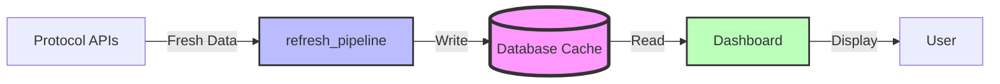
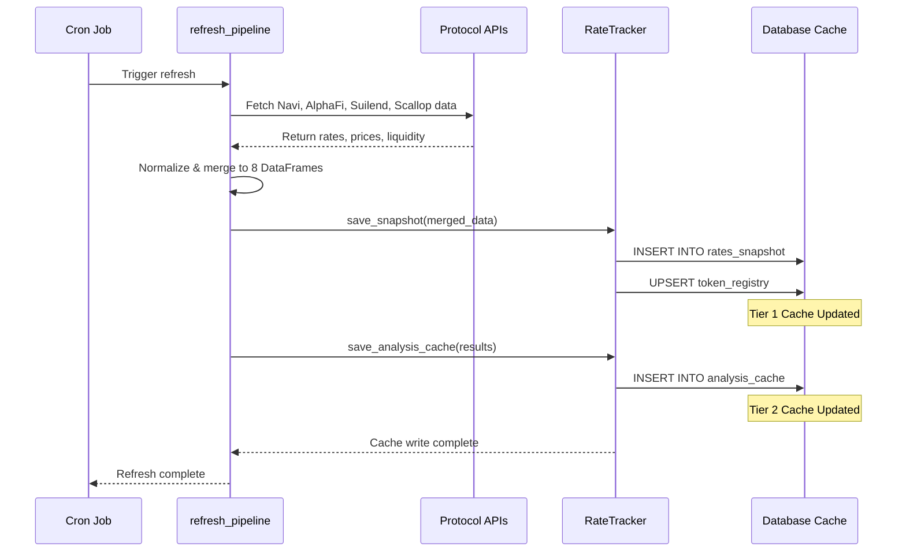
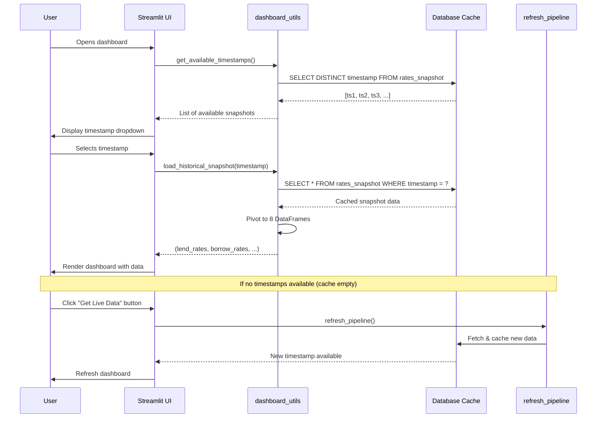
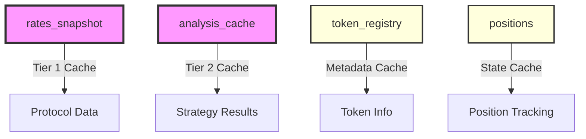

# Sui Lending Bot - Comprehensive Architecture Map

## Overview

This document provides a complete architectural map of the Sui Lending Bot project, covering:
1. **Data Flow**: refresh_pipeline → database insertion
2. **Dashboard Flow**: User journey from opening dashboard → viewing metrics → deploying positions → tracking performance
3. **Database Schema**: All tables, columns, relationships, and purposes
4. **API/SDK Response Structures**: (Future - Point 4 to be added later)

---

## Caching Architecture Overview

### The Database IS the Cache

**Core Architectural Principle**: The database serves as the primary cache layer between protocol APIs and the dashboard. The dashboard NEVER calls protocol APIs directly—all data flows through the database cache.

### Two-Tier Caching Strategy



#### Tier 1: Protocol Data Cache (rates_snapshot)
- **Purpose**: Time-series cache of all lending/borrowing rates, prices, and liquidity data from all protocols
- **Key**: (timestamp, protocol, token_contract)
- **Update Pattern**: Append-only (no updates to historical data)
- **Access Pattern**: Timestamp-based lookups for historical analysis and "time travel"

#### Tier 2: Analysis Results Cache (analysis_cache)
- **Purpose**: Pre-computed strategy analysis results stored as JSON
- **Key**: (timestamp_seconds, liquidation_distance)
- **Update Pattern**: Computed during refresh_pipeline, cached for fast re-rendering
- **Access Pattern**: Direct lookup when user adjusts parameters

#### Future: Chart Cache (Planned, Not Yet Implemented)
- **Purpose**: Rendered chart HTML/JSON for instant display
- **Status**: Planned but not yet implemented

### Architecture Benefits

| Aspect | Value |
|--------|-------|
| **Performance** | Dashboard loads instantly from local database queries |
| **Historical Analysis** | Full time-series enables backtesting and trend analysis |
| **Offline Support** | Dashboard works fully offline with cached data |
| **Time Travel** | Select any historical timestamp to see past market state |
| **Reliability** | Dashboard unaffected by protocol API outages |
| **Cost** | Minimize API calls to external protocols |

### Data Flow Separation

**Write Path (Protocols → Cache)**:
- Triggered by: Scheduled cron jobs or manual refresh
- Frequency: Time-based schedule
  - Weekdays 8am-6pm: Every hour (on the hour)
  - Outside business hours: Every 2-4 hours
- Tools: [refresh_pipeline.py](../data/refresh_pipeline.py), [RateTracker](../data/rate_tracker.py)

**Read Path (Cache → Dashboard)**:
- Triggered by: User opens dashboard or selects timestamp
- Frequency: On-demand, instant
- Tools: [dashboard_utils.py](../dashboard/dashboard_utils.py), [UnifiedDataLoader](../dashboard/data_loaders.py)

---

## 1. REFRESH PIPELINE DATA FLOW

### 1.0 Caching Strategy Overview

The refresh pipeline is the **write path** for the caching system. Its sole purpose is to:
1. Fetch fresh data from protocol APIs
2. Normalize and merge data into unified format
3. **Write to database cache** (rates_snapshot, token_registry, analysis_cache)
4. Validate data quality

**Critical**: The refresh pipeline does NOT serve the dashboard directly. It populates the cache, and the dashboard reads from the cache.



---

### Entry Point: `main.py`

```
main()
  └─ refresh_pipeline(timestamp=datetime.now(), save_snapshots=True)
```

### Phase 1: Data Fetching from Protocols

**File**: [data/protocol_merger.py](../data/protocol_merger.py)

**Function**: `merge_protocol_data(stablecoin_contracts)`

**Protocols & Data Sources**:

| Protocol | Reader Class | Data Source | Method |
|----------|--------------|-------------|--------|
| **Navi** | `NaviReader` | REST API | `GET https://open-api.naviprotocol.io/api/navi/pools?env=prod&sdk=1.3.4-dev.2` |
| **AlphaFi** | `AlphaFiReader` | Node.js SDK (subprocess) | `node data/alphalend/alphalend_reader-sdk.mjs` → RPC |
| **Suilend** | `SuilendReader` | Node.js SDK (subprocess) | `node data/suilend/suilend_reader-sdk.mjs` → RPC |
| **ScallopLend** | `ScallopLendReader` | Node.js SDK (subprocess) | `node data/scallop_shared/scallop_reader-sdk.mjs` → RPC |
| **ScallopBorrow** | `ScallopBorrowReader` | Node.js SDK (subprocess) | `node data/scallop_shared/scallop_reader-sdk.mjs` → RPC |

**Key Configuration**:
- All SDK readers use `SUI_RPC_URL` from [config/settings.py](../config/settings.py)
- Timeout: 60 seconds per protocol
- Error handling: Graceful degradation (failed protocols return empty DataFrames)

**Each Protocol Returns**:
- `lend_df`: Supply rates, rewards, liquidity
- `borrow_df`: Borrow rates, rewards, fees
- `collateral_df`: Collateral factors, LTVs

### Phase 2: Data Transformation & Merging

**File**: [data/protocol_merger.py](../data/protocol_merger.py) (Lines 132-334)

**Process**:

1. **Normalize Contract Addresses**
   ```python
   normalize_coin_type("0x00002::sui::SUI") → "0x2::sui::SUI"
   ```
   - Removes leading zeros for consistent matching

2. **Build Token Universe**
   - Collect all unique token contracts across all protocols
   - Map: `contract_address → {symbol, set_of_protocols}`

3. **Apply Filtering Rules**

   Keep tokens that meet EITHER criterion:
   - **Is a stablecoin** (from [config/stablecoins.py](../config/stablecoins.py)), OR
   - **Has lending rates in 2+ unique protocols** (Note: ScallopLend + ScallopBorrow count as 1 protocol)

   Typical result: ~10 tokens retained from ~40 candidates (75% filtered out)

4. **Build 8 Unified DataFrames**

   For each token, create row with protocol columns:

   | DataFrame | Columns | Data Source | Purpose |
   |-----------|---------|-------------|---------|
   | **lend_rates** | Token, Contract, Navi, AlphaFi, Suilend, ScallopLend, ScallopBorrow | `supply_info.get('Supply_apr')` | Supply APR across protocols |
   | **borrow_rates** | Token, Contract, Navi, AlphaFi, ... | `borrow_info.get('Borrow_apr')` | Borrow APR across protocols |
   | **collateral_ratios** | Token, Contract, Navi, AlphaFi, ... | `collateral.get('Collateralization_factor')` | LTV/collateral factor |
   | **prices** | Token, Contract, Navi, AlphaFi, ... | `lend_info.get('Price')` | USD price per token |
   | **lend_rewards** | Token, Contract, Navi, AlphaFi, ... | `supply_info.get('Supply_reward_apr')` | Supply reward APR |
   | **borrow_rewards** | Token, Contract, Navi, AlphaFi, ... | `borrow_info.get('Borrow_reward_apr')` | Borrow reward APR |
   | **available_borrow** | Token, Contract, Navi, AlphaFi, ... | `lend_info.get('Available_borrow_usd')` | Available borrow liquidity (USD) |
   | **borrow_fees** | Token, Contract, Navi, AlphaFi, ... | `lend_info.get('Borrow_fee')` | Upfront borrow fee (decimal) |

   **Important**: Each cell is `NaN` if protocol doesn't support that token

### Phase 3: Database Persistence

**File**: [data/rate_tracker.py](../data/rate_tracker.py)

**Condition**: Only if `save_snapshots=True` (default)

**Step 3A: Initialize RateTracker**

```python
tracker = RateTracker(
    use_cloud=settings.USE_CLOUD_DB,       # SQLite vs PostgreSQL
    db_path="data/lending_rates.db",        # SQLite file
    connection_url=settings.SUPABASE_URL    # PostgreSQL URL
)
```

**Step 3B: Save Rate Snapshot**

**Function**: `tracker.save_snapshot()` → `_save_rates_snapshot()`

**Process**:
1. Extract protocol list from DataFrame column headers
2. For EACH token × protocol combination:
   - Get total APRs (lend, borrow)
   - Calculate base APRs:
     - **Lend base** = lend_total - lend_reward
     - **Borrow base** = borrow_total + borrow_reward
   - Get collateral ratio, price, available_borrow, borrow_fee
3. Create 1 row per token/protocol combination
4. Insert into **`rates_snapshot`** table

**Typical Snapshot**: ~47 rows (10 tokens × 4-5 protocols)

**Step 3C: Save Token Registry**

**Function**: `tracker.upsert_token_registry()`

**Process**:
1. Extract unique tokens: `{symbol, contract}`
2. Upsert into **`token_registry`** table
3. Update discovery metadata:
   - `seen_on_navi`, `seen_on_alphafi`, etc. (sticky flags - once 1, stays 1)
   - `first_seen`, `last_seen` timestamps
   - `pyth_id`, `coingecko_id` (NEVER overwritten - manual enrichment)

**Step 3D: Data Quality Validation**

**Thresholds**:
- Minimum rows: 20 (normal: ~47)
- Minimum protocols: 2 (expect: 3+)

**Alert**: If thresholds fail → Slack notification to ops team

### Phase 4: Strategy Analysis

**File**: [analysis/rate_analyzer.py](../analysis/rate_analyzer.py)

**Function**: `RateAnalyzer(merged_data).find_best_protocol_pair()`

**Step 4A: Analyze All Combinations**

Iterate through:
- All token combinations: {token1, token2, token3}
- All protocol pairs: {protocol_A, protocol_B}
- **Constraint**: token1 MUST be stablecoin (market-neutral requirement)

**Step 4B: Calculate Position Sizes**

**File**: [analysis/position_calculator.py](../analysis/position_calculator.py)

**Function**: `PositionCalculator.analyze_strategy()`

**Geometric Series Calculation**:
```
L_A = 1.0 / (1.0 - r_A × r_B)    # Total lent in Protocol A
B_A = L_A × r_A                   # Total borrowed from Protocol A
L_B = B_A                         # Total lent in Protocol B (= borrowed from A)
B_B = L_B × r_B                   # Total borrowed from Protocol B
```

Where:
- `r_A` = collateral ratio at Protocol A
- `r_B` = collateral ratio at Protocol B

**Step 4C: Calculate Net APR**

```
Net APR = (earnings) - (costs) - (fees)

Earnings:
  + L_A × lend_rate_token1_A       [Lend stablecoin in Protocol A]
  + L_B × lend_rate_token2_B       [Lend high-yield token in Protocol B]

Costs:
  - B_A × borrow_rate_token2_A     [Borrow high-yield from Protocol A]
  - B_B × borrow_rate_token1_B     [Borrow stablecoin from Protocol B]

Fees:
  - B_A × borrow_fee_2A            [Transaction fee on Token2 borrow]
  - B_B × borrow_fee_3B            [Transaction fee on Token3 borrow]
```

**Step 4D: Build Results DataFrame**

**Columns**:
- Token identifiers: `token1`, `token2`, `token3` (symbols)
- Contracts: `token1_contract`, `token2_contract`, `token3_contract`
- Protocols: `protocol_A`, `protocol_B`
- Position sizes: `L_A`, `B_A`, `L_B`, `B_B`
- Component rates: `lend_apr_token1_A`, `borrow_apr_token2_A`, etc.
- Performance: `net_apr`, `apr5`, `apr30`, `apr90`
- Constraints: `liquidation_distance`, `max_size`, `valid`
- Metadata: `timestamp` (Unix seconds), `is_stablecoin_only`

**Output**: DataFrame with 200+ strategies, sorted by `net_apr` descending

### Complete Call Chain Summary

```
main.py:main()
  │
  └─ refresh_pipeline(timestamp, save_snapshots=True)
     │
     ├─ merge_protocol_data(stablecoin_contracts)
     │  │
     │  ├─ fetch_protocol_data("Navi")
     │  │  └─ NaviReader.get_all_data()
     │  │     └─ REST API: https://open-api.naviprotocol.io/...
     │  │
     │  ├─ fetch_protocol_data("AlphaFi")
     │  │  └─ AlphaFiReader.get_all_data()
     │  │     └─ subprocess: node alphalend_reader-sdk.mjs
     │  │
     │  ├─ fetch_protocol_data("Suilend")
     │  │  └─ SuilendReader.get_all_data()
     │  │     └─ subprocess: node suilend_reader-sdk.mjs
     │  │
     │  ├─ fetch_protocol_data("ScallopLend")
     │  │  └─ ScallopLendReader.get_all_data()
     │  │     └─ subprocess: node scallop_reader-sdk.mjs
     │  │
     │  ├─ fetch_protocol_data("ScallopBorrow")
     │  │  └─ ScallopBorrowReader.get_all_data()
     │  │     └─ subprocess: node scallop_reader-sdk.mjs
     │  │
     │  └─ Merge: normalize_coin_type() → token universe → 8 DataFrames
     │
     ├─ tracker = RateTracker(use_cloud, db_path, connection_url)
     │  │
     │  ├─ tracker.save_snapshot()
     │  │  │
     │  │  ├─ _save_rates_snapshot()
     │  │  │  ├─ _insert_rates_sqlite() [for SQLite]
     │  │  │  └─ _insert_rates_postgres() [for PostgreSQL]
     │  │  │     → rates_snapshot table (upsert ~47 rows)
     │  │  │
     │  │  ├─ _save_reward_prices()
     │  │  │  → reward_token_prices table (currently stubbed)
     │  │  │
     │  │  └─ _validate_snapshot_quality()
     │  │     └─ SlackNotifier.alert_error() [if quality < threshold]
     │  │
     │  └─ tracker.upsert_token_registry()
     │     ├─ _upsert_token_registry_sqlite() [for SQLite]
     │     └─ _upsert_token_registry_postgres() [for PostgreSQL]
     │        → token_registry table (upsert ~10 tokens)
     │
     ├─ analyzer = RateAnalyzer(merged_data, timestamp)
     │  │
     │  ├─ find_best_protocol_pair()
     │  │  └─ analyze_all_combinations()
     │  │     └─ calculator.analyze_strategy()
     │  │        ├─ calculate_positions() [geometric series]
     │  │        └─ calculate_net_apr() [earnings - costs - fees]
     │  │           → strategy_results DataFrame (200+ rows)
     │  │
     │  └─ SlackNotifier.alert_top_strategies() [if enabled]
     │
     └─ Return RefreshResult(
        timestamp,
        lend_rates, borrow_rates, collateral_ratios, prices,
        lend_rewards, borrow_rewards, available_borrow, borrow_fees,
        protocol_A, protocol_B, all_results, token_summary
     )
```

---

## 2. DASHBOARD DATA FLOW (Read from Cache)

### 2.0 Cache-First Architecture

**Core Principle**: The dashboard is the **read path** for the caching system. It NEVER calls protocol APIs directly—it only reads from the database cache.

#### Cache Lookup Flow



#### Cache Miss Handling

- **Normal Operation**: Dashboard shows timestamp dropdown with all available snapshots
- **Cache Empty**: If no timestamps in database, show "Get Live Data" button
- **Manual Refresh**: User can trigger `refresh_pipeline()` to fetch fresh data
- **Offline Mode**: Dashboard works fully offline if cache populated

#### Performance Characteristics

| Operation | Source | Latency |
|-----------|--------|---------|
| **Load timestamp list** | Database query | <50ms |
| **Load snapshot data** | Database query | <200ms |
| **Render dashboard** | In-memory DataFrames | <500ms |
| **Total page load** | Database cache | <1 second |

Compare to calling protocol APIs directly:
- Navi API: ~2-5 seconds
- Suilend SDK: ~3-8 seconds
- AlphaFi SDK: ~3-8 seconds
- **Total without cache**: 10-20 seconds per page load

---

### Step 1: User Opens Dashboard

**File**: [dashboard/streamlit_app.py](../dashboard/streamlit_app.py)

**Page Load Sequence**:

1. **Page Configuration** (Lines 28-33)
   - Title: "🤖 Sui Lending Bot Dashboard"
   - Layout: Wide
   - Sidebar: Expanded

2. **Timestamp Selection** (Lines 37-130)

   ```
   get_available_timestamps()
     ↓
   Query: SELECT DISTINCT timestamp FROM rates_snapshot ORDER BY timestamp DESC
     ↓
   Display dropdown: Latest timestamp selected by default
     ↓
   Convert to Unix seconds: current_seconds = to_seconds(selected_timestamp)
   ```

3. **Fallback: "Get Live Data" Button**
   - If no timestamps available
   - Triggers `refresh_pipeline()` to fetch fresh data

### Step 2: Main Dashboard View - Load Data

**Files**:
- [dashboard/streamlit_app.py](../dashboard/streamlit_app.py) (Lines 183-209)
- [data/data_loaders.py](../data/data_loaders.py)
- [dashboard/dashboard_utils.py](../dashboard/dashboard_utils.py)

**Data Loading Flow**:

```
UnifiedDataLoader(timestamp)
  ↓
load_historical_snapshot(timestamp)
  ↓
Query: SELECT * FROM rates_snapshot WHERE timestamp = ?
  ↓
Pivot into 9 DataFrames:
  1. lend_rates (Token × Protocol matrix)
  2. borrow_rates
  3. collateral_ratios
  4. prices
  5. lend_rewards
  6. borrow_rewards
  7. available_borrow
  8. borrow_fees
  9. timestamp (returned as datetime)
```

### Step 3: Strategy Analysis & Rendering

**File**: [dashboard/dashboard_renderer.py](../dashboard/dashboard_renderer.py)

**Analysis Phase**:

```
RateAnalyzer(lend_rates, borrow_rates, collateral_ratios, prices, ...)
  ↓
For each {token1, token2, token3} × {protocol_A, protocol_B} combination:
  ↓
PositionCalculator.analyze_strategy()
  ↓
Calculate:
  1. Position multipliers (L_A, B_A, L_B, B_B)
  2. Gross APR = earnings - costs
  3. Net APR = gross_APR - borrow_fees
  4. Time-adjusted APRs (5-day, 30-day, 90-day)
  5. Max deployable size based on liquidity
  ↓
Results: all_results DataFrame (200+ strategies)
```

**Dashboard Tabs** (4 tabs total):

#### **Tab 1: All Strategies** (Lines 513-638)

**Displays**:
- List of all profitable lending strategies
- **Expander per strategy** showing:
  - Token flow: "USDC → DEEP → USDC"
  - Protocol pair: "Navi ↔ Suilend"
  - Net APR with color coding (🟢 positive / 🔴 negative)
  - 5-day APR (fee-adjusted)
  - Max deployable size

**When User Expands Strategy** (render_all_strategies_tab):

Shows 3 components:

**A) APR Comparison Table** (display_apr_table - Lines 246-363)
```
╔═══════════════════════════════════════════════════════════════╗
│ Strategy │ APR(net) │ APR5  │ APR30 │ APR90 │ Days │ Deploy  │
├──────────┼──────────┼───────┼───────┼───────┼──────┼─────────┤
│ 🔄 Loop  │ 12.34%   │ 11.2% │ 12.1% │ 12.3% │ 45.2 │ 🚀 BTN  │
│ ▶️ Unlvr │ 8.50%    │ 8.50% │ 8.50% │ 8.50% │ 0.0  │ 🚀 BTN  │
└──────────┴──────────┴───────┴───────┴───────┴──────┴─────────┘
```
- **Loop**: 4-leg levered strategy
- **Unlvr**: 3-leg unlevered strategy
- **Deploy Buttons**: Click to deploy either variant

**B) Strategy Details Table** (display_strategy_details - Lines 366-504)
```
╔════════════════════════════════════════════════════════════════╗
│ Row │ Protocol │ Token │ Action │ Rate  │ Weight │ Amount │ $  │
├─────┼──────────┼───────┼────────┼───────┼────────┼────────┼────┤
│  1  │ Navi     │ USDC  │ Lend   │ 3.00% │ 1.50   │ 1500   │ $1 │
│  2  │ Navi     │ DEEP  │ Borrow │ 8.50% │ 1.25   │ 28k    │$.05│
│  3  │ Suilend  │ DEEP  │ Lend   │ 12.0% │ 1.25   │ 28k    │$.05│
│  4  │ Suilend  │ USDC  │ Borrow │ 5.50% │ 0.69   │ 690    │ $1 │
└─────┴──────────┴───────┴────────┴───────┴────────┴────────┴────┘
```
- Shows all 4 legs (or 3 for unlevered)
- Contract addresses, rates, weights, fees, liquidity

**C) Historical Chart** (Lines 573-625)
- User clicks "📈 Load Historical Chart" button
- Calls `get_strategy_history(strategy_row, liquidation_distance)`
- Queries historical rates, renders dual-axis chart (price + APR)

#### **Tab 2: Rate Tables** (Lines 643-718)
- Current lending rates (Token × Protocol matrix)
- Current borrow rates
- Collateral ratios
- Token prices (USD)
- Available borrow liquidity
- Borrow fees

#### **Tab 3: Zero Liquidity** (Lines 964-1029)
- Strategies with insufficient liquidity (`max_size < deployment_usd`)

#### **Tab 4: Positions** (Lines 721-962)
- All deployed positions with performance metrics

### Step 4: User Clicks "Deploy Strategy"

**File**: [dashboard/dashboard_renderer.py](../dashboard/dashboard_renderer.py) (Lines 66-243)

**Trigger**: User clicks 🚀 button in APR Comparison Table

**Session State Update**:
```python
st.session_state.pending_deployment = {
    'strategy_row': strategy_row,
    'is_levered': True/False,  # Which button clicked
    'deployment_usd': deployment_usd,
    'liquidation_distance': liquidation_distance
}
st.session_state.show_deploy_form = True
```

**Deployment Form Appears** (render_deployment_form - Lines 66-243):

```
╔════════════════════════════════════════════════════════════╗
│      PAPER TRADE - Position Deployment Confirmation        │
├────────────────────────────────────────────────────────────┤
│ Strategy Details:                                          │
│   Token Flow:  USDC → DEEP → USDC                         │
│   Protocols:   Navi ↔ Suilend                             │
│   Type:        🔄 Loop / ▶️ No-Loop                        │
├────────────────────────────────────────────────────────────┤
│ APR Projection:                                            │
│   Net APR:    12.34%                                       │
│   APR5:       11.20%                                       │
│   APR30:      12.10%                                       │
│   APR90:      12.30%                                       │
├────────────────────────────────────────────────────────────┤
│ Token Breakdown: [Strategy Details Table - 4 rows]        │
├────────────────────────────────────────────────────────────┤
│ Historical Performance: [Chart - APR over time]           │
├────────────────────────────────────────────────────────────┤
│ Position Parameters:                                       │
│   Deployment Size:       $10,000.00                       │
│   Liquidation Distance:  15%                              │
├────────────────────────────────────────────────────────────┤
│ Notes: [Optional text area]                               │
├────────────────────────────────────────────────────────────┤
│ [✅ Confirm Deploy]  [❌ Cancel]                          │
└────────────────────────────────────────────────────────────┘
```

### Step 5: User Confirms Deployment

**File**: [dashboard/dashboard_renderer.py](../dashboard/dashboard_renderer.py) (Lines 169-224)

**When "✅ Confirm Deploy" Clicked**:

1. **Create PositionService**
   ```python
   conn = get_db_connection()  # SQLite or PostgreSQL
   service = PositionService(conn)
   ```

2. **Build positions dict**
   ```python
   positions = {
       'L_A': L_A,  # e.g., 1.503
       'B_A': B_A,  # e.g., 1.129
       'L_B': L_B,  # e.g., 1.129
       'B_B': B_B   # e.g., 0.852 (or None for unlevered)
   }
   ```

3. **Call PositionService.create_position()**

   **File**: [analysis/position_service.py](../analysis/position_service.py) (Lines 32-171)

   ```python
   position_id = service.create_position(
       strategy_row=pd.Series(strategy_dict),
       positions=positions,
       token1='USDC',
       token2='DEEP',
       token3='USDC',  # or None for unlevered
       token1_contract='0x5d4b...',
       token2_contract='0xdeep...',
       token3_contract='0x5d4b...',  # or None
       protocol_A='Navi',
       protocol_B='Suilend',
       deployment_usd=10000.00,
       is_levered=True,
       is_paper_trade=True,  # Phase 1
       notes=notes_text
   )
   ```

4. **Data Saved to Database**

   **Table**: `positions` (see schema below)

   **Key Fields Stored**:
   - `position_id`: UUID
   - `status`: 'active'
   - `entry_timestamp`: Unix seconds (snapshot timestamp)
   - All entry rates, prices, multipliers (L_A, B_A, L_B, B_B)
   - Entry APRs (net_apr, apr5, apr30, apr90)
   - Liquidation distance, max size, borrow fees
   - User notes

5. **Success Response**
   ```
   ✅ Paper position created: {position_id}
   📊 View your position in the Positions tab
   ```

### Step 6: Positions Tab - View Deployed Positions

**File**: [dashboard/dashboard_renderer.py](../dashboard/dashboard_renderer.py) (Lines 721-962)

**Query Phase** (Lines 732-752):

```python
# Get active positions
active_positions = service.get_active_positions()
  ↓
Query: SELECT * FROM positions WHERE status = 'active'
  ↓
Returns DataFrame with all deployed positions

# Get latest rates
Query: SELECT MAX(timestamp) FROM rates_snapshot
latest_timestamp = result

Query: SELECT protocol, token, lend_total_apr, borrow_total_apr,
       borrow_fee, price_usd FROM rates_snapshot WHERE timestamp = latest_timestamp
  ↓
rates_df = all current rates and prices
```

**For Each Active Position**:

**Summary Header** (Line 848):
```
▶ 2024-01-15 14:30 | USDC → DEEP → USDC | Navi ↔ Suilend |
  Entry 12.34% | Current 11.95% | Realized 8.20% | Value $10,245.50
```

**When User Expands Position**:

**Summary Table**:
```
Entry Time    │ Token Flow    │ Protocols    │ Capital  │ Entry │ Current
2024-01-15... │ USDC→DEEP→... │ Navi ↔ Suil. │ $10,000  │ 12.34%│ 11.95%
```

**Detail Table** (4 rows for levered, 3 for unlevered):
```
╔════════════════════════════════════════════════════════════════════════╗
│ Protocol│Token│Action│Weight│Entry Rate│Entry Amt│Curr Amt│Entry$│Live$│
├─────────┼─────┼──────┼──────┼──────────┼─────────┼────────┼──────┼─────┤
│ Navi    │USDC │Lend  │1.503 │3.00%     │1500.00  │1500.00 │$1.00 │$1.00│
│ Navi    │DEEP │Borrow│1.129 │8.50%     │28,345.50│28,100  │$0.045│$0.048│
│ Suilend │DEEP │Lend  │1.129 │12.00%    │28,345.50│28,100  │$0.045│$0.048│
│ Suilend │USDC │Borrow│0.852 │5.50%     │852.00   │852.00  │$1.00 │$1.00│
└─────────┴─────┴──────┴──────┴──────────┴─────────┴────────┴──────┴─────┘
```

### Step 7: Position Performance Calculations

**File**: [analysis/position_service.py](../analysis/position_service.py)

**Current Net APR** (Lines 844-851):
```python
gross_apr = (L_A × lend_1A) + (L_B × lend_2B) - (B_A × borrow_2A) - (B_B × borrow_3B)
fee_cost = (B_A × borrow_fee_2A) + (B_B × borrow_fee_3B)
current_net_apr = gross_apr - fee_cost
```

**Current Position Value** (Lines 261-454):
```python
def calculate_position_value(position, live_timestamp):
    """
    Calculate: deployment_usd + net_earnings

    net_earnings = lend_earnings - borrow_costs - fees
    """

    # Query all historical timestamps between entry and live
    Query: SELECT DISTINCT timestamp FROM rates_snapshot
           WHERE timestamp >= entry_timestamp AND timestamp <= live_timestamp

    # For each time period [T, T+1):
    for period in time_periods:
        lend_earnings += deployment × (L_A × lend_1A + L_B × lend_2B) × period_years
        borrow_costs += deployment × (B_A × borrow_2A + B_B × borrow_3B) × period_years

    # One-time fees
    fees = deployment × (B_A × borrow_fee_2A + B_B × borrow_fee_3B)

    net_earnings = sum(lend_earnings) - sum(borrow_costs) - fees
    current_value = deployment_usd + net_earnings
```

**Realized APR** (Lines 456-478):
```python
def calculate_realized_apr(position, live_timestamp):
    """
    Realized APR = (net_earnings / holding_days × 365) / deployment_usd
    """
    pv_result = calculate_position_value(position, live_timestamp)

    holding_days = (live_timestamp - entry_timestamp) / 86400
    annual_net_earnings = pv_result['net_earnings'] / holding_days × 365
    realized_apr = annual_net_earnings / position['deployment_usd']
```

**Example**:
```
Position deployed: $10,000
Holding period: 30 days
Net earnings: $102.34
Annual net earnings = $102.34 / 30 × 365 = $1,245.13
Realized APR = $1,245.13 / $10,000 = 12.45%
```

**Token Amount Calculations** (Lines 873-889):
```python
Entry Amount = (Weight × deployment_usd) / entry_price
Current Amount = (Weight × deployment_usd) / live_price

Example:
Entry: (1.129 × $10,000) / $0.0450 = 250,888 DEEP
Current: (1.129 × $10,000) / $0.0480 = 235,208 DEEP (price increased)
```

---

## 3. DATABASE SCHEMA

### 3.0 Database as Cache

**Core Architecture**: The database is not just persistent storage—it IS the cache layer. All tables serve caching purposes with specific access patterns optimized for fast reads.

#### Cache Design Principles

1. **Append-Only Model**: Historical data is never updated or deleted
2. **Timestamp-Based Keys**: All cache lookups use timestamp as primary key component
3. **Denormalized for Speed**: Data duplicated across tables for fast queries (no joins required for common queries)
4. **Time-Series Optimized**: Indexes on timestamp columns for range queries
5. **Event Sourcing**: Positions table stores immutable entry state; performance calculated on-the-fly

#### Cache Tables and Their Purpose



| Table | Cache Type | Update Pattern | Read Pattern | Purpose |
|-------|-----------|----------------|--------------|---------|
| **rates_snapshot** | Time-series | Append-only, every refresh | Timestamp lookups | Core protocol data cache |
| **token_registry** | Metadata | Upsert on refresh | Contract address lookups | Token metadata and attribution |
| **analysis_cache** | Computed results | Overwrite on refresh | (timestamp, params) lookups | Pre-computed strategy analysis |
| **positions** | Event log | Insert on deploy, update on close | Status + user queries | Position state tracking |

#### Cache Invalidation Strategy

**No Deletion**: Data is never deleted from cache tables
- **Rationale**: Historical analysis requires full time-series
- **Growth**: ~47 rows per snapshot × 96 snapshots/day = ~4,500 rows/day
- **Storage**: Negligible (<1 MB/day for rates_snapshot)

**Staleness Handling**:
- Dashboard shows timestamp of selected snapshot
- User aware they're viewing historical data
- "Get Live Data" button triggers fresh fetch

---

### Table 1: `rates_snapshot` (Tier 1 Cache)

**Purpose**: Historical time-series of lending/borrowing rates, prices, and market metrics from all protocols.

**Primary Key**: (timestamp, protocol, token_contract)

**Columns**:

| Column | Type | Description |
|--------|------|-------------|
| `timestamp` | TIMESTAMP | Snapshot timestamp (rounded to minute) |
| `protocol` | VARCHAR(50) | Protocol name (Navi, AlphaFi, Suilend, ScallopLend, ScallopBorrow) |
| `token` | VARCHAR(50) | Token symbol (e.g., "USDC", "SUI") |
| `token_contract` | TEXT | Normalized contract address (Sui coin type) |
| `lend_base_apr` | DECIMAL(10,6) | Base lending APR (decimal: 0.0316 = 3.16%) |
| `lend_reward_apr` | DECIMAL(10,6) | Lending reward/incentive APR |
| `lend_total_apr` | DECIMAL(10,6) | Total lending APR (base + reward) |
| `borrow_base_apr` | DECIMAL(10,6) | Base borrowing APR |
| `borrow_reward_apr` | DECIMAL(10,6) | Borrowing reward/incentive APR |
| `borrow_total_apr` | DECIMAL(10,6) | Total borrowing APR (base - reward) |
| `collateral_ratio` | DECIMAL(10,6) | Collateral factor (max % of value that can be borrowed) |
| `liquidation_threshold` | DECIMAL(10,6) | Liquidation trigger point |
| `price_usd` | DECIMAL(20,10) | Token price in USD |
| `utilization` | DECIMAL(10,6) | Pool utilization (total_borrow / total_supply) |
| `total_supply_usd` | DECIMAL(20,10) | Total USD supplied to pool |
| `total_borrow_usd` | DECIMAL(20,10) | Total USD borrowed from pool |
| `available_borrow_usd` | DECIMAL(20,10) | Available borrow liquidity in USD |
| `borrow_fee` | DECIMAL(10,6) | Upfront borrowing fee (one-time cost) |
| `reward_token` | VARCHAR(50) | Reward token symbol (e.g., "SCALLOP") |
| `reward_token_contract` | TEXT | Reward token contract address |
| `reward_token_price_usd` | DECIMAL(20,10) | Reward token price in USD |
| `market` | TEXT | Market identifier (metadata) |
| `side` | TEXT | Supply/Borrow side (metadata) |

**Indexes**:
- `idx_rates_time` ON (timestamp)
- `idx_rates_contract` ON (token_contract)
- `idx_rates_protocol_contract` ON (protocol, token_contract)

**Typical Snapshot**: ~47 rows (10 tokens × 4-5 protocols)

**Data Source**: [data/rate_tracker.py](../data/rate_tracker.py) - `save_snapshot()`

---

### Table 2: `token_registry`

**Purpose**: Catalog of all tokens across protocols, with price API mappings and protocol presence tracking.

**Primary Key**: token_contract

**Columns**:

| Column | Type | Description |
|--------|------|-------------|
| `token_contract` | TEXT | Normalized contract address (PRIMARY KEY) |
| `symbol` | TEXT | Token symbol (e.g., "USDC") |
| `pyth_id` | TEXT | Pyth protocol price feed ID (for oracles) |
| `coingecko_id` | TEXT | CoinGecko API ID (for pricing) |
| `seen_on_navi` | INTEGER | Boolean (0/1) - Appears on Navi |
| `seen_on_alphafi` | INTEGER | Boolean (0/1) - Appears on AlphaFi |
| `seen_on_suilend` | INTEGER | Boolean (0/1) - Appears on Suilend |
| `seen_as_reserve` | INTEGER | Boolean (0/1) - Is reserve (underlying asset) |
| `seen_as_reward_lend` | INTEGER | Boolean (0/1) - Used as lending reward |
| `seen_as_reward_borrow` | INTEGER | Boolean (0/1) - Used as borrow reward |
| `first_seen` | TIMESTAMP | First discovery timestamp |
| `last_seen` | TIMESTAMP | Last update timestamp |

**Update Logic**:
- `pyth_id`, `coingecko_id`: NEVER overwritten (manual enrichment preserved)
- `seen_*` flags: STICKY (once 1, stays 1 - uses MAX operation)
- `symbol`: Keep existing if present, else use new value

**Indexes**:
- `idx_token_registry_last_seen` ON (last_seen)
- `idx_token_registry_pyth_id` ON (pyth_id)
- `idx_token_registry_coingecko_id` ON (coingecko_id)

**Data Source**: [data/rate_tracker.py](../data/rate_tracker.py) - `upsert_token_registry()`

---

### Table 3: `reward_token_prices`

**Purpose**: Standalone pricing for reward tokens (SCALLOP, NAVI, etc.) used in incentive calculations.

**Primary Key**: (timestamp, reward_token_contract)

**Columns**:

| Column | Type | Description |
|--------|------|-------------|
| `timestamp` | TIMESTAMP | Price snapshot timestamp |
| `reward_token` | VARCHAR(50) | Reward token symbol |
| `reward_token_contract` | TEXT | Reward token contract address |
| `reward_token_price_usd` | DECIMAL(20,10) | Price in USD |

**Indexes**:
- `idx_reward_prices_time` ON (timestamp)
- `idx_reward_prices_contract` ON (reward_token_contract)

**Current Status**: Stubbed (placeholder for future implementation)

---

### Table 4: `positions`

**Purpose**: Tracks all trading positions (Phase 1: paper trades, Phase 2: real capital).

**Primary Key**: position_id

**Columns**:

#### **Identification & Status**

| Column | Type | Description |
|--------|------|-------------|
| `position_id` | TEXT | PRIMARY KEY - UUID |
| `status` | TEXT | CHECK('active'\|'closed'\|'liquidated') |
| `strategy_type` | TEXT | Strategy name (default: 'recursive_lending') |
| `is_paper_trade` | BOOLEAN | TRUE for Phase 1, FALSE for Phase 2 |
| `is_levered` | BOOLEAN | 4-leg (TRUE) or 3-leg (FALSE) |
| `user_id` | TEXT | User identifier (nullable Phase 1, required Phase 2) |

#### **Position Composition**

| Column | Type | Description |
|--------|------|-------------|
| `token1` | TEXT | First token symbol (lent at Protocol A) |
| `token2` | TEXT | Second token symbol (borrowed at A, lent at B) |
| `token3` | TEXT | Third token symbol (borrowed at B, NULL for unlevered) |
| `token1_contract` | TEXT | Token1 contract address |
| `token2_contract` | TEXT | Token2 contract address |
| `token3_contract` | TEXT | Token3 contract address (NULL for unlevered) |
| `protocol_A` | TEXT | First protocol (e.g., "Navi") |
| `protocol_B` | TEXT | Second protocol (e.g., "Suilend") |

#### **Entry State**

| Column | Type | Description |
|--------|------|-------------|
| `entry_timestamp` | TIMESTAMP | Position creation time (references rates_snapshot) |
| `deployment_usd` | DECIMAL(20,10) | Initial capital deployed ($) |
| `L_A` | DECIMAL(10,6) | Lend multiplier at Protocol A |
| `B_A` | DECIMAL(10,6) | Borrow multiplier at Protocol A |
| `L_B` | DECIMAL(10,6) | Lend multiplier at Protocol B |
| `B_B` | DECIMAL(10,6) | Borrow multiplier at Protocol B (NULL for unlevered) |
| `entry_lend_rate_1A` | DECIMAL(10,6) | Lending rate at entry (Protocol A, Token1) |
| `entry_borrow_rate_2A` | DECIMAL(10,6) | Borrowing rate at entry (Protocol A, Token2) |
| `entry_lend_rate_2B` | DECIMAL(10,6) | Lending rate at entry (Protocol B, Token2) |
| `entry_borrow_rate_3B` | DECIMAL(10,6) | Borrowing rate at entry (Protocol B, Token3) |
| `entry_price_1A` | DECIMAL(20,10) | Token1 price at entry |
| `entry_price_2A` | DECIMAL(20,10) | Token2 price at entry |
| `entry_price_2B` | DECIMAL(20,10) | Token2 price at entry (Protocol B) |
| `entry_price_3B` | DECIMAL(20,10) | Token3 price at entry |
| `entry_collateral_ratio_1A` | DECIMAL(10,6) | Collateral factor at entry (Protocol A) |
| `entry_collateral_ratio_2B` | DECIMAL(10,6) | Collateral factor at entry (Protocol B) |

#### **Entry APRs & Metrics**

| Column | Type | Description |
|--------|------|-------------|
| `entry_net_apr` | DECIMAL(10,6) | Net APR at entry (strategy yield) |
| `entry_apr5` | DECIMAL(10,6) | Fee-adjusted APR for 5-day horizon |
| `entry_apr30` | DECIMAL(10,6) | Fee-adjusted APR for 30-day horizon |
| `entry_apr90` | DECIMAL(10,6) | Fee-adjusted APR for 90-day horizon |
| `entry_days_to_breakeven` | DECIMAL(10,2) | Days to recover upfront fees |
| `entry_liquidation_distance` | DECIMAL(10,6) | Distance to liquidation (safety margin) |
| `entry_max_size_usd` | DECIMAL(20,10) | Max position size based on liquidity |
| `entry_borrow_fee_2A` | DECIMAL(10,6) | Borrow fee at entry (Protocol A) |
| `entry_borrow_fee_3B` | DECIMAL(10,6) | Borrow fee at entry (Protocol B) |

#### **Slippage (Phase 2)**

| Column | Type | Description |
|--------|------|-------------|
| `expected_slippage_bps` | DECIMAL(10,2) | Expected slippage (basis points) |
| `actual_slippage_bps` | DECIMAL(10,2) | Actual slippage realized |

#### **Closure Tracking**

| Column | Type | Description |
|--------|------|-------------|
| `close_timestamp` | TIMESTAMP | When position was closed |
| `close_reason` | TEXT | Reason: 'user', 'liquidation', 'rebalance', etc. |
| `close_notes` | TEXT | Additional closure notes |

#### **User & On-Chain Data (Phase 2)**

| Column | Type | Description |
|--------|------|-------------|
| `notes` | TEXT | User notes |
| `wallet_address` | TEXT | Wallet address |
| `transaction_hash_open` | TEXT | Opening transaction hash |
| `transaction_hash_close` | TEXT | Closing transaction hash |
| `on_chain_position_id` | TEXT | Blockchain position ID |

#### **Timestamps**

| Column | Type | Description |
|--------|------|-------------|
| `created_at` | TIMESTAMP | Record creation timestamp |
| `updated_at` | TIMESTAMP | Last update timestamp |

**Indexes**:
- `idx_positions_status` ON (status)
- `idx_positions_entry_time` ON (entry_timestamp)
- `idx_positions_user` ON (user_id)
- `idx_positions_protocols` ON (protocol_A, protocol_B)
- `idx_positions_tokens` ON (token1, token2, token3)
- `idx_positions_is_paper` ON (is_paper_trade)

**Data Source**: [analysis/position_service.py](../analysis/position_service.py) - `create_position()`

---

### Database Relationships

```
rates_snapshot (MANY)
    ↓ references
    ├→ token_contract → token_registry (ONE)
    └→ (timestamp, protocol, token) used by positions for entry snapshot

reward_token_prices (MANY)
    ↓ references
    └→ reward_token_contract → token_registry (ONE)

positions (ONE per strategy)
    ↓ references
    ├→ (token1_contract, token2_contract, token3_contract) → token_registry
    ├→ entry_timestamp → rates_snapshot (for historical rate lookups)
    └→ user_id → users table (future Phase 2)
```

---

## 3.5 CACHING IMPLEMENTATION DETAILS

### Cache Write Operations

#### RateTracker.save_snapshot()

**File**: [data/rate_tracker.py](../data/rate_tracker.py) (Lines 58-114)

**Purpose**: Write protocol data to Tier 1 cache (rates_snapshot)

**Process**:
1. Accept 8 merged DataFrames from protocol_merger
2. Extract protocol list from DataFrame columns
3. For each token × protocol combination:
   - Calculate base APRs from total APRs and rewards
   - Extract collateral ratio, price, liquidity, fees
4. Insert rows into rates_snapshot table
5. Validate snapshot quality (row count, protocol coverage)

**Code Reference**:
```python
def save_snapshot(self, lend_rates, borrow_rates, collateral_ratios,
                  prices, lend_rewards, borrow_rewards,
                  available_borrow, borrow_fees, timestamp=None):
    """
    Save a complete market snapshot to the database cache.

    This is the primary write operation for Tier 1 cache.
    Typical snapshot: ~47 rows (10 tokens × 4-5 protocols)
    """
    # Implementation in rate_tracker.py:58-114
```

**Database Operations**:
- SQLite: `INSERT OR REPLACE INTO rates_snapshot`
- PostgreSQL: `INSERT ... ON CONFLICT (timestamp, protocol, token_contract) DO UPDATE`

#### RateTracker.upsert_token_registry()

**File**: [data/rate_tracker.py](../data/rate_tracker.py) (Lines 271-358)

**Purpose**: Update token metadata cache

**Update Logic**:
- `symbol`: Keep existing if present, else use new value
- `seen_*` flags: STICKY (once 1, stays 1 using MAX operation)
- `pyth_id`, `coingecko_id`: NEVER overwritten (manual enrichment preserved)
- `first_seen`: Set on first insert, never changed
- `last_seen`: Updated every time token is seen

**Rationale**: Tracks protocol attribution over time without losing historical context

#### RateTracker.save_analysis_cache()

**File**: [data/rate_tracker.py](../data/rate_tracker.py) (Lines 629-667)

**Purpose**: Write pre-computed strategy results to Tier 2 cache

**Cache Key**: (timestamp_seconds, liquidation_distance)

**Data Format**: JSON-serialized strategy analysis DataFrame

**Usage Pattern**:
- Write: After running RateAnalyzer.find_best_protocol_pair()
- Read: When user adjusts liquidation_distance in dashboard
- Benefit: Avoid recomputing 200+ strategy combinations

**Status**: Implementation exists in schema, write logic pending integration

---

### Cache Read Operations

#### get_available_timestamps()

**File**: [dashboard/dashboard_utils.py](../dashboard/dashboard_utils.py) (Lines 53-79)

**Purpose**: List all available cache snapshots for timestamp picker

**Query**:
```sql
SELECT DISTINCT timestamp
FROM rates_snapshot
ORDER BY timestamp DESC
```

**Returns**: List of datetime strings for dropdown UI

**Performance**: <50ms (indexed on timestamp column)

#### load_historical_snapshot()

**File**: [dashboard/dashboard_utils.py](../dashboard/dashboard_utils.py) (Lines 82-180)

**Purpose**: Load complete market snapshot from cache at specific timestamp

**Query**:
```sql
SELECT *
FROM rates_snapshot
WHERE timestamp = ?
```

**Process**:
1. Query all rows for selected timestamp
2. Pivot into 8 DataFrames:
   - Each DataFrame has Token × Protocol matrix structure
   - lend_rates, borrow_rates, collateral_ratios, prices, etc.
3. Return tuple: (df1, df2, ..., df8, timestamp)

**Performance**: <200ms for typical snapshot (~47 rows)

**Cache Hit Rate**: 100% (always hits database, never calls APIs)

#### UnifiedDataLoader

**File**: [dashboard/data_loaders.py](../dashboard/data_loaders.py) (Lines 45-89)

**Purpose**: Abstraction layer for loading data (cache or live)

**Usage**:
```python
loader = UnifiedDataLoader(timestamp_seconds)
result = loader.load_data()
# Returns: (lend_rates, borrow_rates, ..., timestamp)
```

**Future**: Could implement multi-tier cache lookup (memory → database → API)

---

### Cache Invalidation & Staleness

#### Append-Only Model

**Key Principle**: Cache entries are NEVER updated or deleted after creation

**Rationale**:
1. Historical analysis requires immutable time-series
2. Simplifies debugging (can replay any point in time)
3. Enables backtesting strategies with historical data
4. Storage cost negligible compared to benefits

**Growth Rate**:
- Snapshot frequency: Time-based schedule (hourly during business hours, 2-4 hours off-peak)
- Snapshots per day: ~15-20 (varies by day/schedule)
- Rows per snapshot: ~47
- Daily growth: ~700-940 rows
- Storage: <200 KB/day for rates_snapshot

**Retention Policy**: Currently unlimited (TBD: archive after 90 days)

#### Staleness Handling

**Dashboard Awareness**:
- Timestamp displayed prominently in UI
- User selects which snapshot to view
- "Live" concept = most recent cached snapshot

**Manual Refresh**:
- "Get Live Data" button triggers refresh_pipeline()
- Fetches fresh data from protocols
- Writes new snapshot to cache
- Dashboard updates to show new timestamp

**No Auto-Refresh**: Dashboard does not poll or auto-refresh to avoid surprise data changes during analysis

---

### Cache Performance Optimizations

#### Database Indexes

All cache tables have strategic indexes for fast lookups:

**rates_snapshot**:
- `idx_rates_time` ON (timestamp) → Fast timestamp range queries
- `idx_rates_contract` ON (token_contract) → Fast token lookups
- `idx_rates_protocol_contract` ON (protocol, token_contract) → Fast protocol-specific queries

**token_registry**:
- `idx_token_registry_last_seen` ON (last_seen) → Find recently active tokens
- `idx_token_registry_pyth_id` ON (pyth_id) → Pyth oracle integration
- `idx_token_registry_coingecko_id` ON (coingecko_id) → CoinGecko price lookups

**positions**:
- `idx_positions_status` ON (status) → Fast active position queries
- `idx_positions_entry_time` ON (entry_timestamp) → Historical position analysis

#### Query Patterns

**Fast Queries** (indexed):
- Get latest snapshot: `WHERE timestamp = (SELECT MAX(timestamp) FROM rates_snapshot)`
- Get position snapshot: `WHERE timestamp = ? AND protocol = ? AND token_contract = ?`
- List active positions: `WHERE status = 'active'`

**Avoid** (not indexed):
- Full table scans without WHERE clause
- Filtering on non-indexed columns
- Complex JOINs across tables

---

### Comparison: Before vs After Caching

| Aspect | Old Approach (No Cache) | Current Approach (Database Cache) |
|--------|------------------------|----------------------------------|
| **Data Source** | Direct API calls from dashboard | Database cache |
| **Dashboard Load Time** | 10-20 seconds (API latency) | <1 second (DB query) |
| **Refresh Trigger** | Every page load | Scheduled cron (time-based) |
| **API Call Frequency** | Every user interaction | 15-20 calls/day total (all users) |
| **Historical Data** | Not available | Full time-series since deployment |
| **Offline Support** | None (requires API access) | Full dashboard works offline |
| **Time Travel** | Not possible | Select any historical timestamp |
| **Reliability** | Dashboard fails if APIs down | Dashboard unaffected by API outages |
| **Cost** | High (API rate limits, RPC costs) | Low (one-time fetch, many reads) |
| **Backtesting** | Not possible | Can replay historical strategies |
| **Debugging** | Cannot reproduce past states | Can investigate any historical issue |

---

## 4. API/SDK RESPONSE STRUCTURES (Future Section)

**Note**: Per your request, this section will document the raw JSON/response payloads from:
- ✅ **Suilend**: Already documented in `./data/suilend/` (reserve and parsedReserve map)
- ⏳ **Navi**: To be added (REST API response structure)
- ⏳ **Alphalend**: To be added (SDK response structure)
- ✅ **Scallop**: Already documented in `./data/scallop_shared/`

This will be added in a future update to complete the architecture map.

---

## Key Design Principles (from DESIGN_NOTES.md)

1. **Timestamp as "Current Time"**: Selected timestamp IS "now" - all queries use `WHERE timestamp <= strategy_timestamp`

2. **No datetime.now() Defaults**: Timestamp required explicitly, fail loudly if missing

3. **Unix Seconds**: All internal Python uses Unix timestamps (int), conversion only at boundaries (DB/UI)

4. **Rate Representation**: All rates stored as decimals (0.05 = 5%), convert to percentages only at display

5. **Token Identity**: All logic uses contract addresses (via `normalize_coin_type()`), symbols only for display

6. **Event Sourcing**: Positions table stores immutable entry state, performance calculated on-the-fly

---

## Critical Files Reference

### Cache Write (Protocols → Database)

**Pipeline Orchestration**:
- [data/refresh_pipeline.py](../data/refresh_pipeline.py) - Main orchestration, triggers all cache writes
  - `refresh_pipeline()` - Entry point for cache refresh cycle

**Protocol Data Fetching**:
- [data/protocol_merger.py](../data/protocol_merger.py) - Fetch & normalize protocol data
  - `merge_protocol_data()` - Main function (lines 132-334)
  - `fetch_protocol_data()` - Per-protocol fetcher
  - `normalize_coin_type()` - Contract address normalization

**Protocol Readers** (Data Sources):
- [data/navi/navi_reader.py](../data/navi/navi_reader.py) - Navi REST API reader
- [data/alphalend/alphalend_reader.py](../data/alphalend/alphalend_reader.py) - AlphaFi SDK wrapper
- [data/suilend/suilend_reader.py](../data/suilend/suilend_reader.py) - Suilend SDK wrapper
- [data/scallop_shared/scallop_reader.py](../data/scallop_shared/scallop_reader.py) - Scallop SDK wrapper

**Cache Manager** (Write to Database):
- [data/rate_tracker.py](../data/rate_tracker.py) - RateTracker class (cache manager)
  - `save_snapshot()` (lines 58-114) - Write Tier 1 cache (rates_snapshot)
  - `_save_rates_snapshot()` (lines 116-205) - Internal snapshot writer
  - `_insert_rates_sqlite()` / `_insert_rates_postgres()` - DB-specific writes
  - `upsert_token_registry()` (lines 271-358) - Update token metadata cache
  - `save_analysis_cache()` (lines 629-667) - Write Tier 2 cache (analysis results)
  - `_validate_snapshot_quality()` - Data quality checks

---

### Cache Read (Database → Dashboard)

**Cache Query Layer**:
- [dashboard/dashboard_utils.py](../dashboard/dashboard_utils.py) - Database query functions
  - `get_available_timestamps()` (lines 53-79) - List cached snapshots
  - `load_historical_snapshot()` (lines 82-180) - Load snapshot from cache
  - `get_db_connection()` - Database connection factory

**Data Loader Abstraction**:
- [dashboard/data_loaders.py](../dashboard/data_loaders.py) - Unified data loading
  - `UnifiedDataLoader` (lines 45-89) - Main loader class
  - `load_data()` - Load from cache or trigger refresh

**Dashboard UI**:
- [dashboard/streamlit_app.py](../dashboard/streamlit_app.py) - Streamlit entry point
  - Timestamp picker (uses get_available_timestamps)
  - "Get Live Data" button (triggers refresh_pipeline)
  - Main dashboard rendering
- [dashboard/dashboard_renderer.py](../dashboard/dashboard_renderer.py) - UI rendering logic
  - `render_dashboard()` - Main render function
  - Strategy tables, charts, position tracking

---

### Cache Schema & Management

**Database Schema**:
- [data/schema.sql](../data/schema.sql) - Table definitions for all cache tables
  - `rates_snapshot` - Tier 1 cache (protocol data)
  - `token_registry` - Token metadata cache
  - `analysis_cache` - Tier 2 cache (strategy results)
  - `positions` - Position state tracking

**Database Initialization**:
- [data/init_db.py](../data/init_db.py) - Database setup and migrations
  - `initialize_database()` - Create tables and indexes
  - Support for SQLite and PostgreSQL

**Configuration**:
- [config/settings.py](../config/settings.py) - Database and cache settings
  - `USE_CLOUD_DB` - SQLite vs PostgreSQL toggle
  - `SUPABASE_URL` - PostgreSQL connection string
  - Cache refresh frequency settings

---

### Strategy Analysis (Computed Cache)

- [analysis/rate_analyzer.py](../analysis/rate_analyzer.py) - Strategy analysis engine
  - `RateAnalyzer.find_best_protocol_pair()` - Compute all strategies
  - Results written to analysis_cache by RateTracker
- [analysis/position_calculator.py](../analysis/position_calculator.py) - Position calculations
  - `PositionCalculator.analyze_strategy()` - Geometric series math
  - `calculate_net_apr()` - APR calculations
- [analysis/position_service.py](../analysis/position_service.py) - Position CRUD
  - `create_position()` - Save to positions table
  - `calculate_position_value()` - Real-time performance from cache

---

## Summary

This architecture map documents the complete data flow and caching architecture of the Sui Lending Bot:

### Core Architecture: Database as Cache

The fundamental design principle is that **the database IS the cache**. All data flows through this cache layer:

```
Protocol APIs → refresh_pipeline → Database Cache → Dashboard → User
```

### What's Documented

- ✅ **Caching Architecture**: Two-tier caching strategy (rates_snapshot + analysis_cache)
- ✅ **Write Path**: Complete refresh_pipeline flow from API calls → database cache writes
- ✅ **Read Path**: Complete dashboard flow from cache queries → user display
- ✅ **Database Schema**: All cache tables with purposes, indexes, and access patterns
- ✅ **Cache Implementation**: Write/read operations, invalidation strategy, performance optimizations
- ✅ **Critical Files**: Grouped by cache function (write, read, schema, analysis)
- ⏳ **API/SDK Response Structures**: To be added later as requested

### Key Benefits of This Architecture

1. **Performance**: Dashboard loads in <1 second vs 10-20 seconds without cache
2. **Historical Analysis**: Full time-series enables backtesting and trend analysis
3. **Reliability**: Dashboard works offline and unaffected by protocol API outages
4. **Cost Efficiency**: Minimize expensive API/RPC calls (96/day total vs per-user)
5. **Time Travel**: Select any historical timestamp to analyze past market states
6. **Developer Experience**: Clear separation of write path (refresh_pipeline) and read path (dashboard)

### Design Principles Referenced

All implementation follows principles documented in [DESIGN_NOTES.md](../DESIGN_NOTES.md):
- Timestamp as "Current Time" - selected timestamp IS "now"
- Unix Seconds - all internal timestamps as integers
- Token Identity - all logic uses contract addresses, not symbols
- Event Sourcing - immutable entry state, performance calculated on-the-fly
- Append-Only Cache - no updates or deletes to historical data

### Navigation

All flows are traced from entry points through transformations to final storage/display, with file references and line numbers for easy code navigation.
