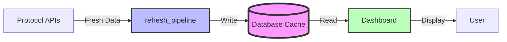

# Sui Lending Bot - Architecture Overview

**Version**: 2.0
**Last Updated**: March 2026
**System Status**: Production deployment on Railway with Supabase PostgreSQL

---

## Documentation Map

- **architecture.md** (this file): Highest-level system overview
- **[dashboard_reference.md](dashboard_reference.md)**: Dashboard tabs, data pipeline, UI flows
- **[positions_and_portfolio_reference.md](positions_and_portfolio_reference.md)**: Positions tab, Portfolio Allocator — complete technical reference
- **[Historical_Data_Reference.md](Historical_Data_Reference.md)**: Historical data system, Analysis tab, basis charting

---

## System Overview

The Sui Lending Bot analyzes recursive lending strategies across Sui DeFi protocols (AlphaFi, Navi, Suilend, Pebble, Scallop), tracks paper trade positions, and provides a time-travel dashboard for historical analysis.

**Deployment**: Railway (cloud) + Supabase PostgreSQL
**Refresh**: Hourly, top of each hour
**Dashboard**: Streamlit (9 tabs)
**Phase**: Paper trading (Phase 1). Real on-chain execution is planned for Phase 2.

---

## Core Architectural Principle: The Database IS the Cache

The database acts as the primary cache between protocol APIs and the dashboard. The dashboard never calls protocol APIs directly.


```mermaid
graph LR
    A[Protocol APIs] -->|Fresh Data| B[refresh_pipeline]
    B -->|Write| C[(Database Cache)]
    C -->|Read| D[Dashboard]
    D -->|Display| E[User]

    style C fill:#f9f,stroke:#333,stroke-width:4px
    style B fill:#bbf,stroke:#333,stroke-width:2px
    style D fill:#bfb,stroke:#333,stroke-width:2px
```

### Write Path (Protocols → Cache)
- **Triggered by**: Railway scheduler, every hour at the top of the hour
- **Entry point**: `data/refresh_pipeline.py`
- **Writes to**: `rates_snapshot` (immutable append), `analysis_cache` (48hr TTL), `token_registry` (upsert)

### Read Path (Cache → Dashboard)
- **Triggered by**: User opens dashboard or selects timestamp
- **Entry point**: `dashboard/dashboard_renderer.py`
- **Reads from**: `rates_snapshot`, `positions`, `position_rebalances`, `analysis_cache`
- **Latency**: < 1 second total page load (vs 10-20 seconds calling protocol APIs directly)

---

## Two-Tier Caching Strategy

| Tier | Table | Purpose | Key | Pattern |
|------|-------|---------|-----|---------|
| **Tier 1** | `rates_snapshot` | Time-series of all rates, prices, fees, liquidity | `(timestamp, protocol, token_contract)` | Append-only, permanent |
| **Tier 2** | `analysis_cache` | Pre-computed strategy analysis results (JSON) | `(timestamp_seconds, liquidation_distance)` | 48-hour retention |

The Tier 1 cache enables time-travel: selecting any historical timestamp replays the market state at that moment. The Tier 2 cache makes the All Strategies tab render instantly without rerunning strategy analysis.

---

## Data Flow: Strategy Discovery to Position Deployment

```
Phase 1: Data Collection (hourly, Railway)
  refresh_pipeline()
  └─ merge_protocol_data() → fetch from Navi, AlphaFi, Suilend, Scallop
     └─ Normalize, merge into 8 DataFrames
        └─ RateTracker.save_snapshot() → INSERT INTO rates_snapshot (~47 rows)
           └─ RateTracker.save_analysis_cache() → INSERT INTO analysis_cache

Phase 2: Strategy Discovery (analysis layer)
  RateAnalyzer.analyze_all_combinations()
  └─ For each {token1, token2, token3} × {protocol_A, protocol_B}:
     └─ StrategyCalculator.analyze_strategy()
        └─ Geometric series position sizing + net APR calculation
           └─ Returns DataFrame with 200+ strategies, sorted by net_apr desc

Phase 3: Display (dashboard read path)
  Dashboard reads from analysis_cache or reruns RateAnalyzer
  └─ Tab 1: All Strategies — sortable table, expandable details, deploy button

Phase 4: Position Deployment (explicit user action)
  User clicks Deploy
  └─ PositionService.create_position()
     └─ INSERT INTO positions table
```

**Critical distinctions**:
- Phases 1-3 write nothing to the positions table
- Only Phase 4 creates positions; it requires explicit user confirmation
- `rates_snapshot` is append-only; `positions` is mutable (status changes on close/rebalance)

---

## Rebalancing Flow

Rebalancing is **detected automatically** and **executed manually** (user-confirmed):

1. **Detection**: On each render, the dashboard calculates liquidation distance for each position. If distance has changed beyond threshold (default 15%), a "Rebal Req'd?" indicator is shown.
2. **Auto-rebalance**: `refresh_pipeline()` also runs `PositionService.check_positions_need_rebalancing()` hourly. If liquidation distance delta exceeds `REBALANCE_THRESHOLD` (2%), auto-rebalance fires.
3. **Execution**: `position_service.rebalance_position()` — INSERTs a record into `position_rebalances` (closing the current segment with realized PnL) and resets entry fields on the `positions` row to the new rates/prices.

Each rebalance creates an immutable historical segment. Total PnL = sum of all closed segments + current live segment.

---

## Time-Travel

When the user selects a historical timestamp in the sidebar, that timestamp becomes "now" for all calculations:

- All rate data is fetched from `rates_snapshot WHERE timestamp = selected_timestamp`
- All position PnL is calculated from entry through `selected_timestamp`
- Positions deployed after `selected_timestamp` are hidden
- Rebalances that occurred after `selected_timestamp` are ignored (pre-rebalance state is shown)
- The rebalance button is disabled when viewing a timestamp that has future rebalances (time-travel paradox prevention)

Time-travel is instant — it requires no protocol API calls, only a database query.

---

## Component Map

### Data Layer
| File | Purpose |
|------|---------|
| `data/refresh_pipeline.py` | Hourly orchestration: fetch → normalize → save → analyze → alert |
| `data/protocol_merger.py` | Merges data from all protocol readers into 8 unified DataFrames |
| `data/rate_tracker.py` | RateTracker class: DB writes for snapshots, token registry, analysis cache |
| `data/schema.sql` | Full database schema: tables, indexes, views |
| `data/[protocol]/` | Per-protocol readers (Navi REST API; AlphaFi, Suilend, Scallop via Node.js SDK) |

### Analysis Layer
| File | Purpose |
|------|---------|
| `analysis/rate_analyzer.py` | RateAnalyzer: iterates all token/protocol combinations, generates strategy DataFrame |
| `analysis/position_calculator.py` | PositionCalculator: geometric series position sizing, liquidation price calculation |
| `analysis/position_service.py` | PositionService: create/close/rebalance positions, calculate PnL, time-travel state |
| `analysis/portfolio_allocator.py` | PortfolioAllocator: greedy capital allocation with iterative liquidity constraints |
| `analysis/strategy_calculators/` | Registry + per-type calculator classes (stablecoin, noloop, recursive, perp variants) |
| `analysis/strategy_history/` | Registry + per-type historical APR handlers; feeds Analysis tab and position charts |

### Dashboard Layer
| File | Purpose |
|------|---------|
| `dashboard/dashboard_renderer.py` | Main entry point: sidebar, all 9 tabs, strategy modal, deployment flow |
| `dashboard/position_renderers.py` | Strategy renderer registry: per-type rendering of position leg tables |
| `dashboard/analysis_tab.py` | Analysis tab (Tab 9): historical rates table, APR chart, basis chart |
| `dashboard/dashboard_utils.py` | UnifiedDataLoader, get_db_connection(), get_available_timestamps() |
| `dashboard/db_utils.py` | SQLAlchemy engine factory with connection pooling (PostgreSQL: pool_size=5) |

### Utilities
| File | Purpose |
|------|---------|
| `utils/time_helpers.py` | `to_seconds()` and `to_datetime_str()` — canonical timestamp conversion |
| `config/settings.py` | All configuration: DB mode, thresholds, feature flags |

---

## Database Tables

| Table | Type | Purpose |
|-------|------|---------|
| `rates_snapshot` | Append-only | Time-series of all rates, prices, fees per token/protocol |
| `positions` | Mutable | Paper trade positions; entry state captured at deployment |
| `position_rebalances` | Append-only | Historical segments created by each rebalance |
| `token_registry` | Upsert | Token metadata: symbol, contracts, Pyth/CoinGecko IDs, protocol flags |
| `reward_token_prices` | Last-write-wins | Reward/governance token pricing |
| `analysis_cache` | 48hr TTL | Pre-computed strategy analysis results |
| `chart_cache` | 48hr TTL | Cached Plotly chart HTML |

For complete schema detail (column definitions, indexes, design rationale), see [positions_and_portfolio_reference.md](positions_and_portfolio_reference.md).

---

## Strategy Calculator and Renderer Registries

The system uses a plugin registry pattern. Each strategy type is registered independently:

**Calculator Registry** (`analysis/strategy_calculators/__init__.py`):

| Strategy Type | Legs | Description |
|--------------|------|-------------|
| `stablecoin_lending` | 1 | Pure stablecoin supply, no borrow |
| `noloop_cross_protocol_lending` | 3 | Lend on Protocol A, borrow, lend on Protocol B — no loop |
| `recursive_lending` | 4 | Full recursive loop (geometric series) |
| `perp_lending` | 2 | Spot lend + perp short |
| `perp_borrowing` | 3 | Stablecoin lend + borrow + long perp |
| `perp_borrowing_recursive` | 3 | Same as perp_borrowing but looped |

**Renderer Registry** (`dashboard/position_renderers.py`): Each strategy type has a corresponding renderer class registered via `@register_strategy_renderer`. Renderers implement `render_detail_table()`, `render_apr_summary_table()`, `build_token_flow_string()`, `get_metrics_layout()`, and `validate_position_data()`.

See [Strategy_Position_Decorator_Reference.md](Strategy_Position_Decorator_Reference.md) for the renderer interface contract.

---

## Key Design Principles

1. **Timestamp as "Now"**: The selected timestamp IS current time. Never use `datetime.now()` in dashboard code except during fresh data collection.
2. **Database is the Cache**: Dashboard reads only from DB. Protocol APIs are called only in `refresh_pipeline`.
3. **Event Sourcing**: `positions` table = entry state (immutable after creation). `position_rebalances` = append-only historical segments.
4. **Contract Addresses for Logic**: Always use `token_contract` in queries. Symbols are for display only.
5. **Decimals Internally**: Rates stored as 0.0–1.0; convert to percentages only at display.
6. **Timestamp Format**: All DB timestamps must be exactly `'YYYY-MM-DD HH:MM:SS'` (19 chars). Use `to_datetime_str()`.

---

## Recent Architectural Changes

### February 2026
- **Entry token amounts**: Added `entry_token_amount_1a/2a/2b/3b` to positions table. Fixes liquidation price calculation for positions without rebalances.
- **PnL fix**: Changed valuation from `deployment × weight` to `token_amount × current_price`. Corrects PnL when prices drift between rebalances.
- **Iterative liquidity updates** in portfolio allocator: After each allocation, updates available borrow matrix. Prevents over-borrowing beyond protocol liquidity limits.
- **Auto-rebalancing**: Integrated into `refresh_pipeline()`. Fires when liquidation distance changes by > 2%.
- **SQLAlchemy engine factory**: Added `dashboard/db_utils.py` with connection pooling. Eliminates pandas UserWarnings and improves PostgreSQL performance 20-50%.
- **Batch query optimization**: Changed `calculate_leg_earnings_split()` from N+1 queries to a single bulk query per leg. Reduced query count from 6,000+ to ~60 per dashboard render (20-60x speedup).

### January 2026
- **Strategy history system**: Added `analysis/strategy_history/` registry with per-type handlers. Provides historical APR timeseries for all strategy types. Feeds the Analysis tab and position charts.
- **Perp strategies**: Added `perp_lending`, `perp_borrowing`, `perp_borrowing_recursive` strategy types with basis chart support in the Analysis tab.
- **9-tab dashboard**: Expanded from 4 tabs to 9 tabs — added Allocation, Portfolio View, Oracle Prices, Pending Deployments, Analysis.

### Pre-2026
- **Supabase migration**: Migrated from local SQLite to Supabase PostgreSQL. Deployed on Railway.
- **Registry pattern**: Introduced calculator and renderer registries to enable plugin-style strategy type extension.
